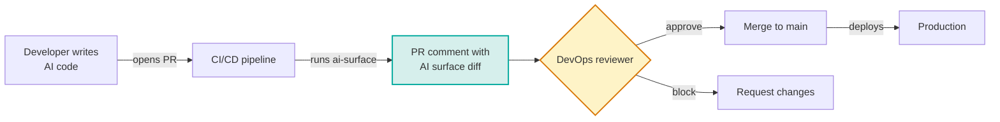
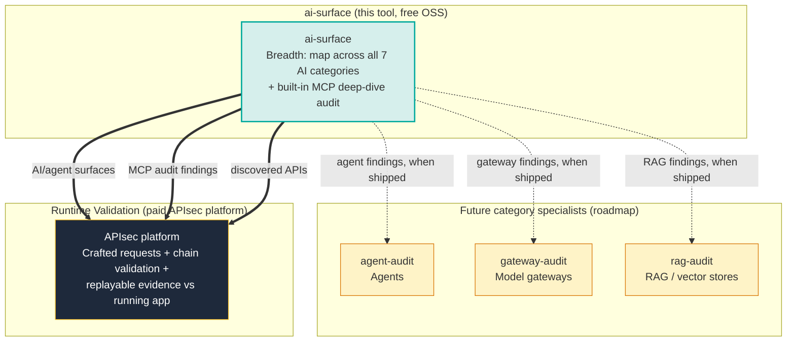
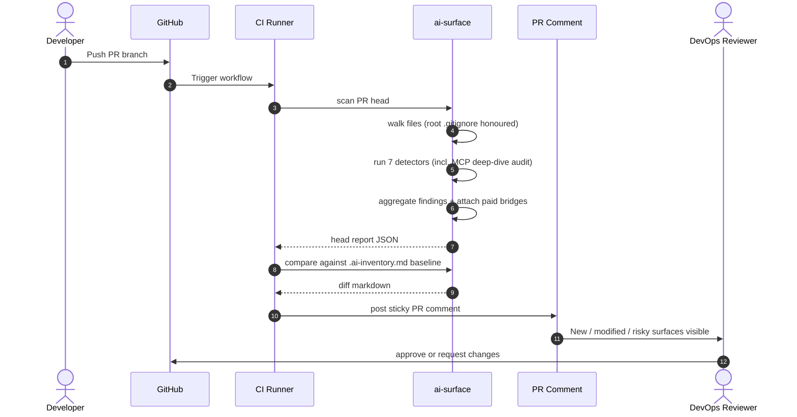
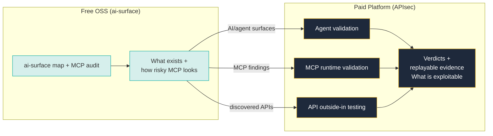

<div align="center">

# `ai-surface`

**Govern your application's AI attack surface from source: inventory it, generate an AI-BOM, and gate the risk at PR time.**

[](https://opensource.org/licenses/MIT)
[](https://www.python.org/downloads/)
[](CHANGELOG.md)
[](#status)
[](tests/)
[](docs/PRIVACY.md)

</div>

> 🔒 **`ai-surface` is a static source-code analyzer that runs entirely on your machine.** A CLI scan makes no network calls and the project contains no telemetry code path of any kind, so your source never leaves the host you run it on. The visual UI serves on loopback only. The full data-handling contract is in [`docs/PRIVACY.md`](docs/PRIVACY.md).

Your application code is growing an AI attack surface (LLM calls, agents, MCP servers, model gateways, self-hosted runtimes, and the HTTP APIs that front them) faster than anyone can govern it, and the mandate to govern it is arriving fast: the EU AI Act, NIST AI RMF, and ISO/IEC 42001 all require you to **know, document, and risk-assess the AI systems you run**. You cannot document what you cannot inventory.

`ai-surface` is the AI-governance gate for your pipeline. It runs in your CI on every PR (and on your laptop on demand), **inventories every AI component your code is about to ship**, generates a standard **AI-BOM** (CycloneDX) the same way your pipeline already generates an SBOM, goes deep on MCP servers with a built-in security audit, and can **fail the build** when a PR introduces a risky surface. Run `ai-surface scan . --ui` to explore it as an interactive, severity-colored attack-surface map in your browser.

It produces the evidence; it does not claim to make you compliant. And it draws a clear line: static discovery is free and local, here. Proving which of these surfaces is actually **exploitable** against your running application is what the [APIsec platform](https://apisec.ai/ai-validation) does.

<br>

## Table of Contents

- [The 60-second demo](#the-60-second-demo)
- [Why ai-surface exists](#why-ai-surface-exists)
- [How it fits in your workflow](#how-it-fits-in-your-workflow)
- [Quick start](#quick-start)
- [GitHub Action](#github-action)
- [What it detects](#what-it-detects)
- [Risk indicators](#risk-indicators)
- [How it works](#how-it-works-internals)
- [Output formats](#output-formats)
- [CLI reference](#cli-reference)
- [What it does not do (yet)](#what-it-does-not-do-yet)
- [Comparison with adjacent tools](#comparison-with-adjacent-tools)
- [Roadmap](#roadmap)
- [Status](#status)
- [Cross-sell: runtime validation](#runtime-validation)
- [Development](#development)
- [License](#license)

<br>

## The 60-second demo

```console
$ ai-surface scan .

AI Attack Surface Report
────────────────────────────────────────────────────────────────
Scanned: acme-payments
28 AI surfaces · 7 categories · 1 critical / 1 high assessed

MCP SERVERS  (discovery + deep-dive audit)
  • MCP Server: stripe-mcp                                [CRITICAL]
      Tools: create_charge, refund, list_customers
      ⚠ secrets-detected  Live Stripe secret key present in MCP env block (LLM02)
        → secret: STRIPE_SECRET_KEY (stripe-key)   value never read or stored
      ⚠ financial-action  MCP exposes refund and charge tools to the model (LLM06)
      ⚠ unverified-source MCP server not found in known registry (LLM03)
  • MCP Server: github-mcp                                [HIGH]
      ⚠ broad-permissions Write + workflow-trigger access to source control
  • MCP Server (in-house): src/ledger_mcp_server.py       [MEDIUM]
      ⚠ in-house MCP server (custom code, audit recommended)

AGENT FRAMEWORKS
  • LangChain Agent: refund_agent (in src/agents/refund.py)
      Tools/perms: lookup_order, refund_payment, cancel_subscription
      ⚠ high blast-radius combination

API ENDPOINTS  (HTTP/REST + OpenAPI)
  • REST API: POST /v1/orders/{id}/refund     fastapi · bearer · openapi.yaml
      ⚠ object-id in path (BOLA candidate)
  • REST API: GET  /v1/accounts/{account_id}/balance   fastapi · bearer
      ⚠ object-id in path (BOLA candidate)

  ... (LLM SDKs, Model Gateways, AI Infrastructure, Provider Keys truncated)
────────────────────────────────────────────────────────────────
Validate which surfaces are exploitable: apisec.ai/ai-validation
  · AI/agent surfaces → agent validation
  · MCP servers       → MCP runtime validation
  · discovered APIs   → API outside-in runtime testing
```

> Prefer to click around instead of read a wall of text? Run `ai-surface scan . --ui` to open the **interactive AI Attack Surface map** in your browser: severity-colored nodes, per-finding detail, the MCP deep-dive audit, and the paid upgrade bridges, all served on loopback so nothing leaves your machine. Or [try the hosted demo](#) to see the UI on sample data without installing anything.
>
> Full captured output for every format is in [`examples/sample-outputs/`](examples/sample-outputs/). Add `--fail-on high` to fail the build when a finding is at or above a severity (the recommended gate), or `--output cyclonedx` to emit an AI-BOM.

<br>

## Why ai-surface exists



Most AI security and observability tools see AI activity **after it ships**: Helicone, LangSmith, Arize show what got called in production. Wiz and cloud platforms see what got deployed. They're useful and complementary.

`ai-surface` runs at the moment a developer is about to merge a change. It catches new MCP servers (and audits them), widened permissions, agents with refund authority, non-literal data flowing into LLM calls, and new HTTP endpoints with object-ids in the path **before they exist in production**.

**PR-time visibility is materially different from post-deploy telemetry.** It's where DevOps governance has the cheapest control point.

<br>

## How it fits in your workflow

`ai-surface` is the **breadth scanner** in a family of OSS tools, and it now carries the MCP deep-dive in-house. The full `mcp-audit` capability is **merged into `ai-surface`**: every MCP server it discovers also gets a security audit (severity, risk flags with OWASP-LLM mappings and remediation, detected secrets by name/type only, and registry/trust). There is no separate MCP tool to point users at anymore. Other category specialists (agents, gateways, RAG) are still future work.



**Today:** `ai-surface` ships breadth discovery across all 7 categories plus the MCP deep-dive audit built in. Everything bridges to the paid APIsec platform for runtime validation. The agent / gateway / RAG specialists are on the roadmap.

<br>

## Quick start

`ai-surface` 1.0 is on PyPI. Pick whichever fits your workflow:

```bash
# Install globally with pipx (recommended for a long-lived CLI)
pipx install ai-surface
ai-surface scan .

# Or one-off, no install at all
uvx ai-surface scan .

# Or inside a project venv
pip install ai-surface
ai-surface scan .

# Or explore the results in your browser
ai-surface scan . --ui
```

Docker, if you would rather not touch your host Python:

```bash
docker run --rm -v "$PWD":/src ghcr.io/apisec-inc/ai-surface scan /src
```

For CI, no laptop install is needed at all: use the [GitHub Action](#github-action) (workflow snippet below). Homebrew and standalone binaries are coming.

Requires **Python 3.9 or newer**. The CLI scan runs 100% locally with no network calls, and `--ui` serves on loopback only. See [`docs/PRIVACY.md`](docs/PRIVACY.md) for the full data-handling contract.

> **Want to see it in action?** Run `ai-surface scan examples/demo-app/` against the included [demo app](examples/demo-app/), or add `--ui` to open the same scan as an interactive map. It exercises every detector category and produces a rich sample report. Captured outputs in [`examples/sample-outputs/`](examples/sample-outputs/). You can also [try the hosted demo](#) to see the UI on sample data without installing anything.

### Recommended first-run flow on a mature repo

The first scan of an established codebase will surface every AI component already shipping, which is by design but can feel like noise. The pattern that scales:

```bash
# 1. Inventory what's there today and snapshot it as the baseline.
ai-surface scan . --update-baseline
# → reviews the full picture once, captures it to .ai-surface-baseline.json

# 2. From here on, only report what changes.
ai-surface scan . --baseline
# → shows ONLY new / modified / removed surfaces since the snapshot

# 3. In CI, fail the build only when a PR introduces a NEW high-or-critical
#    AI risk. This is the gate that survives: it never blocks on pre-existing
#    debt, and inventory (severity-free findings) never trips it.
ai-surface scan . --baseline --fail-on high
```

This `--baseline --fail-on high` combination is the recommended PR gate: low-noise (assessed severity only), non-blocking on existing surfaces, and actionable (it prints the offending finding, file, and fix). Use `--fail-on critical` for the strictest gate, or `--fail-on-risk` for the aggressive "any indicator" mode.

The `.ai-surface-baseline.json` file is plain JSON. Commit it to track your team's accepted inventory in git, or add it to `.gitignore` if you prefer to regenerate locally.

<br>

## GitHub Action

Drop this into `.github/workflows/ai-surface.yml`:

```yaml
name: AI Surface Check
on: [pull_request]

permissions:
  contents: read
  pull-requests: write

jobs:
  ai-surface:
    runs-on: ubuntu-latest
    steps:
      - uses: actions/checkout@v4
        with: { fetch-depth: 0 }    # required for base-vs-head diff
      - uses: apisec-inc/AI-Surface@v1
        with:
          path: '.'
          comment-on-pr: 'true'
          fail-on: 'high'        # fail the PR only on NEW high-or-critical findings
```

`fail-on` is the recommended gate: it comments on every PR for visibility, but only **fails the build when a PR introduces a new finding at or above the given severity** (`critical`/`high`/`medium`/`low`), gating on assessed severity so inventory never trips it. Omit it (or set `comment-on-pr` only) to run in report-only mode. Use `fail-on-risk: 'true'` for the aggressive "any risk indicator" gate.

Every PR gets a **sticky comment** showing what changed in this PR, not just current state.

### Example PR comment

> ### AI Surface Changes
>
> **1 new, 1 modified**
>
> #### New AI surfaces
>
> - **MCP Server: stripe-mcp**
>   - Tools/permissions: `read_charges`, `refund`
>   - Files: `.mcp.json`
>   - ⚠️ broad permissions
>   - ⚠️ financial action exposed
>
> #### Modified AI surfaces
>
> - **LangChain Agent: refund_agent (in src/agents/refund.py)**
>   - Permissions added: `cancel_subscription`
>   - ⚠️ Risk added: high blast-radius combination

When the base branch isn't reachable (push event, first PR ever, fork PR without base history), the comment falls back to a full inventory of the current state.

Set `fail-on-risk: 'true'` to block PRs that introduce any risk indicators.

> **See [`docs/CI_INTEGRATION.md`](docs/CI_INTEGRATION.md) for advanced configuration:** policy files, multi-repo rollups, custom risk thresholds.

<br>

## What it detects

Seven categories, one per detector:

| Category | Coverage | Examples |
|---|---|---|
| **LLM SDK call sites** | 12 providers | Anthropic, OpenAI, Azure OpenAI, AWS Bedrock (direct + Strands wrapper), Google Generative AI, Vertex AI, Together, Mistral, Cohere, Replicate, Groq, LiteLLM. Models extracted, data-flow risk flagged. |
| **Agent frameworks** | 10 frameworks | LangChain, LangGraph, CrewAI, LlamaIndex, AutoGen, Haystack, Semantic Kernel, Pydantic AI, AWS Strands, plus Anthropic-shape `tools=[{...}]`. Tool inventories per agent. |
| **MCP servers** | Discovery **plus deep-dive audit** | Configured (`.mcp.json`, `mcp_servers/`) and source-resident in-house servers (Python `FastMCP`, `mcp.Server`, JS `@modelcontextprotocol/sdk`). Each gets a security audit: a **severity**, risk flags (shell / filesystem / database / network / secret / source) with **OWASP-LLM mappings and remediation**, detected secrets (NAME and TYPE only, never values, and values are redacted from snippets), and registry/trust signals. |
| **API endpoints** | HTTP/REST routes + OpenAPI specs | OpenAPI / Swagger specs (every `path` + method pair) and framework route definitions: FastAPI / Starlette, Flask, Express, Spring, Django. Captures method, path, framework, and detected auth style, and flags a **BOLA candidate** when a path carries an object-id segment (`{id}`, `:id`, `<int:id>`). |
| **Model gateways** | Configs + source | LiteLLM proxy configs, Portkey, Helicone, Cloudflare AI Gateway, OpenRouter. Routed-model inventories. |
| **AI infrastructure** | Manifests + IaC | Kubernetes / Helm / docker-compose workloads running ollama, vllm, TGI, SGLang, Triton, llama.cpp and others; AI-runtime Dockerfiles; Terraform Bedrock provisioned throughput / custom models, SageMaker LLM endpoints, Vertex AI endpoints. |
| **AI provider env keys** | Names only | `OPENAI_API_KEY`, `ANTHROPIC_API_KEY`, `AZURE_OPENAI_*`, `GROQ_API_KEY`, `LANGSMITH_API_KEY`, etc. across `.env` files. **Never reads values.** |

Discovery stays severity-free by design: inventory-only categories carry no severity. Severity is set only by the deep-dive audit layer, which today is MCP. See [`docs/SCHEMA_v1.md`](docs/SCHEMA_v1.md) for the frozen report contract.

> **See [`docs/DETECTORS.md`](docs/DETECTORS.md) for the complete coverage list, including every pattern matched and every framework version supported.**

<br>

## Risk indicators

Every finding can carry plain-English, severity-free **risk indicators** for human review:

| Indicator | Triggered by |
|---|---|
| `broad permissions` | MCP server with admin/write/delete capabilities |
| `in-house MCP server` | Custom MCP server code (audit recommended) |
| `financial action exposed` | Tool names containing refund/payment/charge/transfer |
| `destructive action exposed` | Tool names containing delete/drop/truncate/purge |
| `messaging action exposed` | send_email, send_slack, send_sms tool names |
| `database write exposed` | Database mutation tool patterns |
| `high blast-radius combination` | Agent with both read AND destructive/financial tools |
| `non-literal data flows into LLM call` | Variable references in `messages=` or `prompt=` |
| `object-id in path (BOLA candidate)` | API route with an object-id segment (`{id}`, `:id`, `<int:id>`) |
| `multiple AI provider keys present` | More than one provider configured |
| `observability/tracing key present` | Production telemetry to third-party vendors |
| `multi-model routing layer` | Production traffic flowing through gateway |
| `self-hosted LLM runtime` | Operational responsibility on the team |
| `high-cost AI infrastructure` | Billing exposure (e.g., Bedrock provisioned throughput) |

These descriptive indicators are distinct from the **MCP deep-dive audit**, which adds *structured* risk flags carrying a severity, an OWASP-LLM mapping, and remediation guidance (for example `secrets-detected` → critical → LLM02). See the [What it detects](#what-it-detects) MCP row and [`docs/SCHEMA_v1.md`](docs/SCHEMA_v1.md).

<br>

## How it works (internals)

`ai-surface` is a **static source-code analyzer**. It reads files, pattern-matches, and produces a report. No code execution, no network calls, no credentials needed.



**What stays local:**

- Reads files from the directory you point it at, honouring the **root `.gitignore`** (nested gitignores, `.git/info/exclude`, and your global excludesfile are not consulted)
- Pattern-matches against known AI surface signatures
- Writes findings to stdout, a JSON file, a markdown file, or a PR comment

**What it does NOT do:**

- Run any of your code
- Connect to APIsec, third parties, or any external service during a normal scan
- Need credentials, tokens, or authentication to function
- Read `.env` file *values* (key names only)
- Persist anything beyond the report file you ask for

The only network call is the GitHub Action posting a PR comment via the GitHub API, using a token your workflow provides. **Local CLI runs are 100% offline.**

> **See [`docs/ARCHITECTURE.md`](docs/ARCHITECTURE.md) for the deep dive on detector design, the `Finding` schema, and how to add a custom detector.**

<br>

## Output formats

```bash
ai-surface scan .                          # rich terminal output
ai-surface scan . --ui                     # interactive map in a local browser viewer
ai-surface scan . --output json            # machine-readable JSON (schema 1.0)
ai-surface scan . --output markdown        # markdown report
ai-surface scan . --write-inventory        # writes .ai-inventory.md to scan root
ai-surface scan . --quiet                  # one-line summary for CI
```

The `--ui` viewer renders the **AI Attack Surface map**: a radial cluster of severity-colored nodes, one per finding, with a detail drawer that shows evidence, the MCP deep-dive audit (risk flags, OWASP-LLM badges, detected secrets by name only), and the paid upgrade bridge for that surface. It serves the engine's schema-1.0 JSON over `127.0.0.1` from a throwaway temp directory. No scanning happens in the browser, no network egress, no telemetry. Press Ctrl-C to stop the server.

The `.ai-inventory.md` file is a **committable artifact**. Engineers browsing the repo see the AI surfaces in the same place they read everything else. The GitHub Action uses it as the diff baseline for PR comments.

<br>

## CLI reference

```bash
# Scan and report
ai-surface scan .                                # pretty terminal
ai-surface scan . --ui                           # interactive map in a local browser
ai-surface scan . --output json                  # machine-readable (schema 1.0)
ai-surface scan . --output markdown              # markdown
ai-surface scan . --write-inventory              # generates .ai-inventory.md

# Filter to specific categories
ai-surface scan . --categories mcp               # MCP servers only (with audit)
ai-surface scan . --categories agents,llm        # agents + LLM SDKs
ai-surface scan . --categories api               # HTTP / REST / OpenAPI endpoints only
ai-surface scan . --categories infra             # AI infrastructure only
# Aliases: mcp, agents, llm, gateway, infra, keys, api

# CI gate (recommended): severity threshold, exit code 1 at or above it
ai-surface scan . --fail-on high                 # fail on any critical/high finding
ai-surface scan . --fail-on critical             # strictest: fail only on critical
ai-surface scan . --fail-on high --quiet         # gate + one-line summary
# Gates on ASSESSED severity only, so the inventory never trips it. Prints the
# offending finding, file, and remediation so the CI log is actionable.

# Aggressive legacy gate: exit 1 if ANY risk indicator is present
ai-surface scan . --fail-on-risk                 # works in any CI, not just the GitHub Action

# Baseline mode: snapshot the current inventory, then later show only what is NEW
ai-surface scan . --update-baseline              # writes .ai-surface-baseline.json
ai-surface scan . --baseline                     # diff vs the snapshot
ai-surface scan . --baseline --fail-on high      # the recommended PR gate: fail only on NEW high+ findings
ai-surface scan . --baseline --baseline-file ci/baseline.json   # custom path

# CI / scripted use
ai-surface scan . --quiet                        # → ai-surface: 28 surfaces, 24 risks, 7 detectors

# Verbose mode
ai-surface scan . --verbose                      # all files (no truncation), surface detector errors

# Compare two scans (used by the GitHub Action under the hood)
ai-surface scan . --output json > base.json
git checkout pr-branch
ai-surface scan . --output json > head.json
ai-surface compare base.json head.json           # markdown diff
ai-surface compare base.json head.json --output json
```

<br>

## What it does not do (yet)

- **Runtime telemetry or behavior monitoring.** Use Helicone, LangSmith, Arize, or Phoenix for that.
- **Runtime exploit validation.** `ai-surface` maps and audits the surface statically; it does not prove exploitability against a running app. That is the paid APIsec platform (see [Runtime validation](#runtime-validation)).
- **Live cluster scanning.** A fast-follow on the roadmap.
- **Multi-repo or org-wide rollup.** A fast-follow on the roadmap.
- **Prompt injection or LLM behavior testing.** Different problem; out of scope by design. See the APIsec platform for runtime exploit validation.
- **Cross-file dataflow for tool resolution.** Regex/AST-light today. This means the scanner can miss surfaces that only become clear across files. Treat the map as a strong floor, not a proof of completeness.
- **Secret-value reads or PII classification.** The MCP audit reports detected secrets by NAME and TYPE only and redacts values from snippets; it never reads or stores a value. `ai-surface` does not classify PII. Use a dedicated secret scanner (gitleaks, GitGuardian) for value-level coverage.
- **Standardised AI-BOM export** (SPDX / CycloneDX) and **SARIF**. The schema-1.0 JSON and `.ai-inventory.md` are ai-surface's own formats today; AI-BOM and SARIF are fast-follows.

<br>

## Comparison with adjacent tools

| Tool | What it tells you | When it sees AI |
|---|---|---|
| **SAST** (Semgrep, Snyk Code, CodeQL) | Code-pattern vulnerabilities | After commit; doesn't index AI surfaces specifically |
| **DAST** (Burp, ZAP) | Reachable web surfaces with vulnerabilities | After deploy; sees HTTP, not LLM internals |
| **SCA** (Snyk Open Source, Dependabot) | Vulnerable dependencies | After commit; sees packages, not how they're used |
| **Observability** (Helicone, LangSmith, Arize, Phoenix) | What LLM calls happened, latency, cost | After deploy; sees runtime traffic |
| **Cloud posture** (Wiz, Orca) | What's deployed in cloud | After deploy; sees infra, not code |
| **`ai-surface`** | **What AI attack surface is about to ship** (mapped, with MCP audited) | **At PR time, before merge** |
| **APIsec platform** | Which AI surfaces are actually exploitable | At PR time + runtime; produces replayable evidence |

`ai-surface` doesn't replace any of these. It plugs the **PR-time AI-attack-surface** gap that none of them fills.

<br>

## Roadmap

| Version | Status | What's in it |
|---|---|---|
| **v1.0** | Current (shipped) | Code-side mapping across **7 categories** (LLM SDKs, agents, MCP, model gateways, AI infra, provider keys, **API endpoints**), the **MCP deep-dive audit merged in** (severity, OWASP-LLM risk flags, secret name/type detection, registry/trust), the **interactive `--ui` map viewer**, the frozen **schema 1.0** report contract with paid bridges, terminal + JSON + markdown reporters, GitHub Action with PR diff comments, base-vs-head comparison, `--fail-on-risk` CI gate, `--baseline` mode for "only new since snapshot" runs. On PyPI. |
| **Fast-follow** | Planned | SARIF output, AI-BOM export (SPDX / CycloneDX), `.ai-surface.yml` policy file, an optional opt-in local-machine MCP scan, GitLab CI component. |
| **Later** | Planned | kubectl plugin, live cluster discovery, GitHub repo settings ingestion, continuous mode, drift alerts, multi-repo / org-wide rollup, hosted dashboard option, plugin SDK for custom detectors. |

<br>

## Status

**v1.0.0, production/stable (June 2026).** Code-side mapping across seven categories, with the MCP deep-dive audit built in and an interactive `--ui` surface map. The report follows the frozen schema-1.0 contract, so JSON consumers and the UI can rely on it. The CLI works end to end with a `--fail-on-risk` gate that works in any CI and a `--baseline` mode that lets day-two runs surface only what has changed since a stored snapshot. The GitHub Action ships and posts sticky PR diff comments. Available on PyPI. The roadmap above lists the fast-follows, and feedback is still what we want most.

If you find a false positive, false negative, or bug, please [file an issue](https://github.com/apisec-inc/AI-Surface/issues) using the templates.

<br>

## Runtime validation

<a id="runtime-validation"></a>

`ai-surface` tells you **what AI attack surface exists** and, for MCP, how risky it looks statically. To validate which surfaces are actually exploitable in a running application (agent-to-tool authorization, integration chain exploits, BOLA across the agent layer, replayable evidence backed by code AND runtime), see [**APIsec**](https://apisec.ai/ai-validation).

Each finding routes to one of three paid destinations (the funnel). The viewer and reports surface the right one per surface:

| Source surface | Paid destination |
|---|---|
| AI / agent surfaces (LLM SDKs, agents, gateways, infra) | agent validation |
| MCP servers | MCP runtime validation |
| Discovered APIs | API outside-in runtime testing |

The disconnect between free discovery and paid runtime validation is intentional: bridges are an upgrade path, not an integration. No finding data leaves your machine. The bridge is a deep link.



<br>

## Development

```bash
git clone https://github.com/apisec-inc/AI-Surface
cd AI-Surface
python -m venv .venv && source .venv/bin/activate
pip install -e ".[dev]"
pytest
```

The codebase is structured for parallel detector development:

```
src/ai_surface/
├── cli.py                  # Typer entry point (scan, compare, version; --ui flag)
├── orchestrator.py         # Runs detectors, aggregates findings, attaches bridges
├── types.py                # Finding, Detector protocol, Report + schema-1.0
│                           #   additions: Audit, RiskFlag, Secret, Bridge, Summary
├── cross_promo.py          # The funnel: attaches paid-platform bridges per finding
├── ui_server.py            # Local loopback server for `scan --ui`
├── ui/                     # Static visual viewer (index.html, app.js, styles.css)
├── detectors/              # One module per detector (one per category)
│   ├── mcp_audit.py        # MCP discovery + deep-dive audit (supersedes mcp_servers)
│   ├── mcp_servers.py      # shallow MCP discovery (reused by mcp_audit; fallback)
│   ├── api_endpoints.py    # HTTP/REST + OpenAPI endpoint discovery
│   ├── llm_sdks.py
│   ├── agent_frameworks.py
│   ├── env_keys.py
│   ├── model_gateways.py
│   └── ai_infra.py
├── data/
│   └── mcp/                # MCP audit knowledge: OWASP-LLM map, risk defs,
│                           #   secret patterns, known-server registry/trust
├── reporters/              # Output renderers
│   ├── terminal_reporter.py
│   ├── json_reporter.py
│   └── markdown_reporter.py
└── utils/
    ├── walk.py             # file walker (root .gitignore only)
    └── specs.py            # shared YAML / HCL parsing helpers
```

Adding a detector: implement the `Detector` protocol in `types.py`, register in `default_detectors()`, add fixtures + tests under `tests/`. The report shape is frozen in [`docs/SCHEMA_v1.md`](docs/SCHEMA_v1.md). See [CONTRIBUTING.md](CONTRIBUTING.md) for full details.

<br>

## Project

| Resource | Link |
|---|---|
| **Examples** | [examples/](examples/) (demo app, sample outputs, CI workflow templates) |
| **Issues** | [github.com/apisec-inc/AI-Surface/issues](https://github.com/apisec-inc/AI-Surface/issues) |
| **Discussions** | [github.com/apisec-inc/AI-Surface/discussions](https://github.com/apisec-inc/AI-Surface/discussions) |
| **Changelog** | [CHANGELOG.md](CHANGELOG.md) |
| **Security policy** | [SECURITY.md](SECURITY.md) |
| **Contributing** | [CONTRIBUTING.md](CONTRIBUTING.md) |
| **APIsec platform** | [apisec.ai](https://apisec.ai/ai-validation) |

<br>

## License

MIT. See [LICENSE](LICENSE).

---

<div align="center">

**Built by [APIsec](https://apisec.ai) · Part of the APIsec Labs OSS family**

</div>
