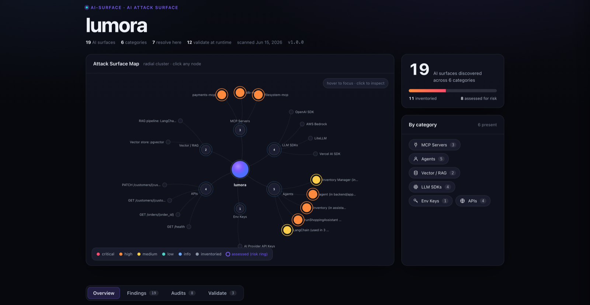
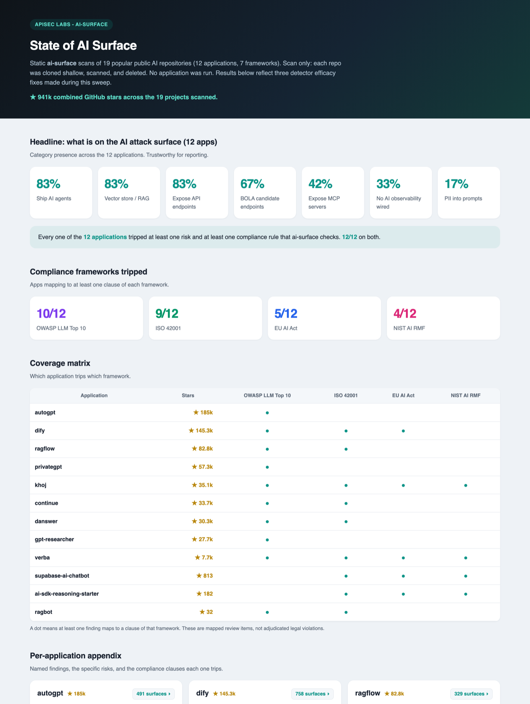
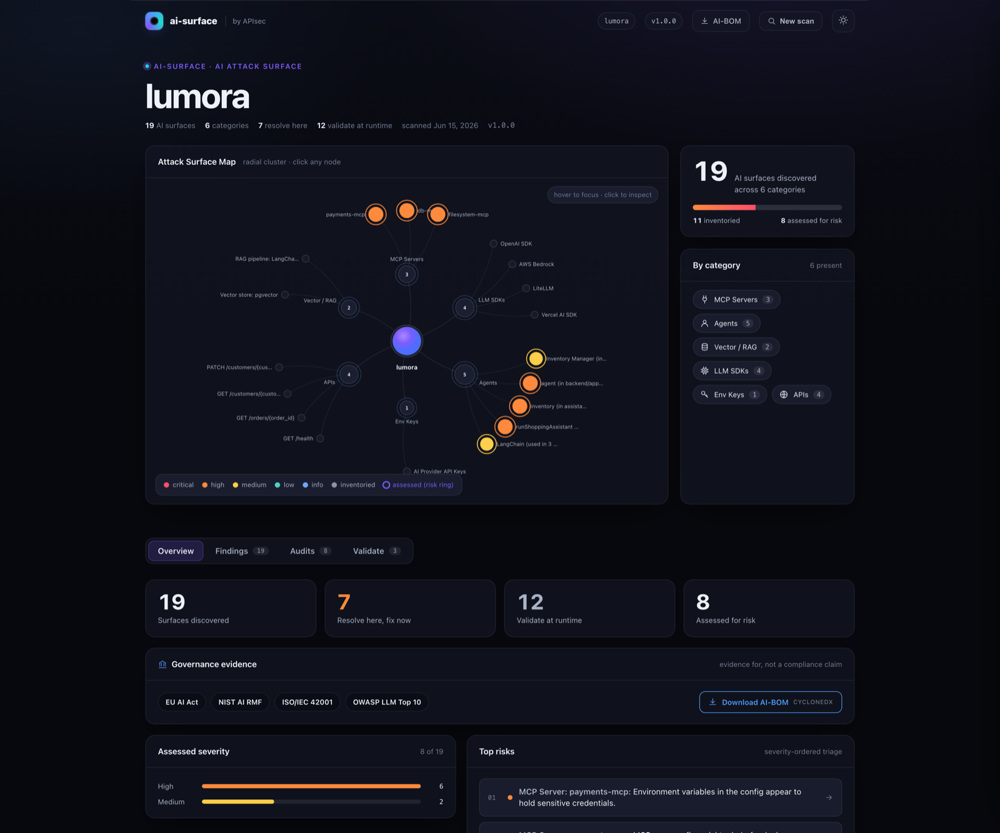
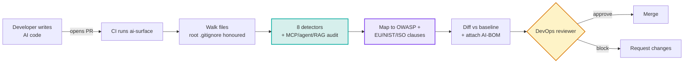

<div align="center">

# `ai-surface`

**Inventory your application's AI attack surface from source, map it to AI-governance frameworks, generate an AI-BOM, and gate the risk at PR time.**

[](https://opensource.org/licenses/MIT)
[](https://www.python.org/downloads/)
[](CHANGELOG.md)
[](#status)
[](tests/)
[](docs/PRIVACY.md)
[](docs/COMPLIANCE.md)

</div>

> 🔒 **`ai-surface` is a static source-code analyzer that runs entirely on your machine.** A CLI scan makes no network calls and the project contains no telemetry of any kind, so your source never leaves the host you run it on. The visual UI serves on loopback only. Full data-handling contract: [`docs/PRIVACY.md`](docs/PRIVACY.md).

<div align="center">



<sub>The `--ui` attack-surface map: every detected AI surface as a severity-colored node, grouped by category, served on loopback.</sub>

</div>

Your application is growing an AI attack surface (LLM calls, agents, MCP servers, RAG/vector stores, model gateways, self-hosted runtimes, and the HTTP APIs that front them) faster than anyone can govern it. And the mandate to govern it is here: the **EU AI Act**, **NIST AI RMF**, and **ISO/IEC 42001** all require you to know, document, and risk-assess the AI systems you run. You cannot document what you cannot inventory.

`ai-surface` is the AI-governance gate for your pipeline. It runs in CI on every PR (and on your laptop on demand), **inventories every AI component your code is about to ship across 8 categories**, **maps each finding to the OWASP LLM Top 10 and the specific EU AI Act / NIST / ISO clauses it evidences**, generates a standard **AI-BOM** (CycloneDX) the way your pipeline already generates an SBOM, goes deep on MCP servers and agents with a built-in security audit, and can **fail the build** when a PR introduces a risky surface.

It produces the evidence; it does not claim to make you compliant. And it draws a clear line: static discovery is free and local, here. Proving which of these surfaces is actually **exploitable** against your running application is what the [APIsec platform](https://apisec.ai/ai-validation) does.

<br>

## Proven on real code

We statically scanned **19 of the most popular open-source AI projects on GitHub** (about 941k combined stars: AutoGPT, Dify, RAGFlow, AutoGen, CrewAI, LlamaIndex, Continue, Danswer, and more). Scan only, no app was run. Across the 12 applications in that set:

| | |
|---|---|
| Ship AI agents | **83%** |
| Have a vector store / RAG layer | **83%** |
| Expose API endpoints with BOLA candidates | **67%** |
| Expose MCP servers | **42%** |
| Run an agent or MCP surface with no observability wired | **33%** |
| **Trip at least one risk and one AI-governance rule** | **100% (12/12)** |

The full write-up is the [State of AI Surface](docs/STATE_OF_AI_SURFACE.md) report. Every one of these widely-adopted, production AI projects has an AI attack surface that maps to a governance framework. Yours almost certainly does too.

<div align="center">



</div>

<br>

## Table of Contents

- [The 60-second demo](#the-60-second-demo)
- [Quick start](#quick-start)
- [What it detects](#what-it-detects)
- [Compliance and governance](#compliance-and-governance)
- [Risk indicators](#risk-indicators)
- [GitHub Action](#github-action)
- [Output formats](#output-formats)
- [CLI reference](#cli-reference)
- [How it works](#how-it-works)
- [Comparison with adjacent tools](#comparison-with-adjacent-tools)
- [What it does not do](#what-it-does-not-do)
- [Roadmap](#roadmap)
- [Runtime validation](#runtime-validation)
- [Development](#development)
- [License](#license)

<br>

## The 60-second demo

```console
$ ai-surface scan .

AI Attack Surface Report
────────────────────────────────────────────────────────────────
Scanned: lumora
19 AI surfaces · 6 categories · 8 assessed for risk

MCP SERVERS  (discovery + deep-dive audit)
  • MCP Server: payments-mcp                               [CRITICAL]
      ⚠ secrets-in-env     Live secret present in MCP env block   (LLM02 · EU Art. 15)
      ⚠ financial-action   Exposes refund / payout tools          (LLM06 · EU Art. 9)
      ⚠ no-human-oversight No approval gate on a money-moving tool (EU Art. 14)
      ⚠ unverified-source  Server not found in a known registry   (LLM03 · ISO A.10)

AGENT FRAMEWORKS
  • LangChain Agent: support_agent (in backend/app/ai/support_agent.py)
      Tools: process_refund, lookup_order, send_email, update_address, search_knowledge
      ⚠ high-blast-radius  Read AND financial/destructive tools
      ⚠ pii-to-llm         Customer email/address interpolated into the prompt (EU Art. 10)

VECTOR / RAG
  • RAG pipeline: LangChain  ·  Vector store: pgvector
      ⚠ ingests external content (RAG poisoning surface)   (LLM08 · EU Art. 10)

API ENDPOINTS  (HTTP/REST + OpenAPI)
  • GET  /customers/{customer_id}      ⚠ object-id in path (BOLA candidate)
  • PATCH /customers/{customer_id}     ⚠ object-id in path (BOLA candidate)

  ... (LLM SDKs, Provider Keys truncated)
────────────────────────────────────────────────────────────────
Maps to: EU AI Act · NIST AI RMF · ISO/IEC 42001 · OWASP LLM Top 10
Validate which surfaces are exploitable: apisec.ai/ai-validation
```

> Prefer to click around? Run `ai-surface scan . --ui` to open the **interactive AI Attack Surface map** in your browser (the screenshot above): severity-colored nodes, per-finding evidence, the MCP and agent deep-dive audits, framework badges, and the AI-BOM download, all served on loopback so nothing leaves your machine.

<br>

## Quick start

```bash
# One-off, no install (recommended first run)
uvx ai-surface scan .

# Install globally for a long-lived CLI
pipx install ai-surface
ai-surface scan .

# Or in a project venv
pip install ai-surface
ai-surface scan .

# Explore the results visually
ai-surface scan . --ui
```

Docker, if you would rather not touch your host Python:

```bash
docker run --rm -v "$PWD":/src ghcr.io/apisec-inc/ai-surface scan /src
```

Requires **Python 3.9+**. The CLI scan runs 100% locally with no network calls; `--ui` serves on loopback only.

### Recommended first-run flow on a mature repo

The first scan of an established codebase surfaces everything already shipping. The pattern that scales:

```bash
ai-surface scan . --update-baseline      # 1. snapshot today's inventory to .ai-surface-baseline.json
ai-surface scan . --baseline             # 2. from here on, show only what changed
ai-surface scan . --baseline --fail-on high   # 3. in CI, fail only on NEW high+ risk
```

`--baseline --fail-on high` is the recommended PR gate: low-noise, non-blocking on pre-existing debt, and actionable (it prints the offending finding, file, and fix).

<br>

## What it detects

Eight categories, one per detector. Configuration, keys, and specs are detected on **any stack**; deep code-level detection is strongest on **Python and TypeScript/JavaScript** (full matrix in [`docs/LANGUAGE_SUPPORT.md`](docs/LANGUAGE_SUPPORT.md)).

| Category | Coverage | What it finds |
|---|---|---|
| 🤖 **Agent frameworks** | 10 Python + 6 JS/TS frameworks | LangChain, LangGraph, CrewAI, LlamaIndex, AutoGen, Haystack, Semantic Kernel, Pydantic AI, AWS Strands (Python); LangChain.js, LangGraph.js, Vercel AI SDK, Mastra, OpenAI Agents, LlamaIndex.ts (JS/TS). Extracts each agent's **tool inventory** and flags financial / destructive / high-blast-radius authority. |
| 🔌 **MCP servers** | Discovery **plus deep-dive audit** | Configured (`.mcp.json`, `mcp_servers/`) and in-house source servers (Python `FastMCP` / `mcp.Server`, JS `@modelcontextprotocol/sdk`). Each gets a **severity**, risk flags (shell / filesystem / database / network / secret / source) with **OWASP-LLM + governance mappings and remediation**, detected secrets (name and type only, never values), and registry/trust signals. |
| 🧠 **Vector stores / RAG** | 13 stores + 2 RAG frameworks | Pinecone, Weaviate, Chroma, Qdrant, Milvus, FAISS, LanceDB, pgvector, Elasticsearch/OpenSearch/Vespa/Redis (vector mode), plus LangChain / LlamaIndex retrieval pipelines. Flags managed-store egress, the RAG data flow, embeddings, and external ingestion (the poisoning surface). |
| 💬 **LLM SDK call sites** | 13 providers | Anthropic, OpenAI, Azure OpenAI, AWS Bedrock (direct + Strands), Google Generative AI, Vertex AI, Together, Mistral, Cohere, Replicate, Groq, LiteLLM, Vercel AI SDK. Models extracted, non-literal data flow flagged. |
| 🌐 **API endpoints** | HTTP/REST routes + OpenAPI | OpenAPI / Swagger specs and framework routes (FastAPI / Starlette, Flask, Express, Spring, Django). Captures method, path, framework, auth style, and flags a **BOLA candidate** when a path carries an object-id (`{id}`, `:id`, `<int:id>`). |
| 🚪 **Model gateways** | Configs + source | LiteLLM proxy, Portkey, Helicone, Cloudflare AI Gateway, OpenRouter. Routed-model inventories. |
| 🏗️ **AI infrastructure** | Manifests + IaC | K8s / Helm / docker-compose workloads (ollama, vllm, TGI, SGLang, Triton, llama.cpp), AI-runtime Dockerfiles, Terraform Bedrock / SageMaker / Vertex endpoints. |
| 🔑 **AI provider keys** | Names only | `OPENAI_API_KEY`, `ANTHROPIC_API_KEY`, `AZURE_OPENAI_*`, `LANGSMITH_API_KEY`, etc. across `.env` files. **Never reads values.** |

Discovery stays severity-free by design: inventory categories carry no invented severity. Severity comes only from the deep-dive audit layers (MCP, agents, RAG). See [`docs/DETECTORS.md`](docs/DETECTORS.md) for every pattern matched, and [`docs/SCHEMA_v1.md`](docs/SCHEMA_v1.md) for the frozen report contract.

<br>

## Compliance and governance

Every audited finding maps to the **OWASP LLM Top 10** and to the specific **EU AI Act / NIST AI RMF / ISO 42001** clauses it evidences. The UI renders these as badges; the JSON and CycloneDX outputs carry them as structured data; the CycloneDX output is your **AI-BOM**.

<div align="center">



</div>

**`ai-surface` produces evidence, it does not certify compliance.** A framework requirement is only reported when the scan actually produced that kind of evidence.

### What each framework gets from a scan

| Framework | Inventory | Risk assessment | Human oversight | Logging / monitoring | Data governance |
|---|:--:|:--:|:--:|:--:|:--:|
| **EU AI Act** | Art. 11-12 | Art. 9 | Art. 14 | Art. 12 | Art. 10 |
| **NIST AI RMF** | MAP | MEASURE | - | MEASURE 3 | MEASURE (data) |
| **ISO/IEC 42001** | Annex A | Risk assessment | - | A.6.2.6 | A.7 |
| **OWASP LLM Top 10** | per-finding LLM01-LLM10 mapping | | | | |

### How risk flags map to clauses

| Risk flag | OWASP | EU AI Act | NIST | ISO 42001 |
|---|---|---|---|---|
| `secrets-detected` / `secrets-in-env` | LLM02 | Art. 15 | - | - |
| `financial-action` / `destructive-action` / `high-blast-radius` | LLM06 | Art. 9 | - | - |
| `no-human-oversight` | LLM06 / LLM09 | Art. 14 | - | - |
| `no-observability` | - | Art. 12 | MEASURE 3 | A.6.2.6 |
| `pii-to-llm` | LLM02 | Art. 10 | - | A.7 |
| `unverified-source` / `remote-mcp` / `local-binary` | LLM03 | - | - | A.10 |
| vector store / RAG present | LLM08 | Art. 10 | data | A.7 |

Full detail, including the honesty boundary on what these mappings do and do not assert, is in [**`docs/COMPLIANCE.md`**](docs/COMPLIANCE.md).

<br>

## Risk indicators

Inventory findings carry plain-English, severity-free **risk indicators** for human review:

| Indicator | Triggered by |
|---|---|
| `financial action exposed` | Tool names containing refund / payment / charge / payout / transfer |
| `destructive action exposed` | Tool names containing delete / drop / truncate / purge |
| `high blast-radius combination` | Agent with both read AND destructive/financial tools |
| `object-id in path (BOLA candidate)` | API route with an object-id segment (`{id}`, `:id`, `<int:id>`) |
| `managed vector store` | Indexed data and embeddings leave your environment |
| `ingests external content` | RAG pipeline pulls from external/untrusted sources (poisoning surface) |
| `non-literal data flows into LLM call` | Variable references in `messages=` / `prompt=` |
| `multiple AI provider keys present` | More than one provider configured |
| `self-hosted LLM runtime` | Operational responsibility on the team |

The deep-dive audit layer adds **structured risk flags** that carry a severity, OWASP-LLM mapping, governance clauses, and remediation (see the [compliance table](#how-risk-flags-map-to-clauses) above).

<br>

## GitHub Action

Drop this into `.github/workflows/ai-surface.yml`:

```yaml
name: AI Surface Check
on: [pull_request]

permissions:
  contents: read
  pull-requests: write

jobs:
  ai-surface:
    runs-on: ubuntu-latest
    steps:
      - uses: actions/checkout@v4
        with: { fetch-depth: 0 }    # required for base-vs-head diff
      - uses: apisec-inc/AI-Surface@v1
        with:
          path: '.'
          comment-on-pr: 'true'
          fail-on: 'high'        # fail the PR only on NEW high-or-critical findings
```

Every PR gets a **sticky comment** showing what changed in this PR, not just current state:

> ### AI Surface Changes
> **1 new, 1 modified**
>
> **New AI surfaces**
> - **MCP Server: payments-mcp** · tools `refund`, `payout` · ⚠️ financial action · ⚠️ secrets-in-env
>
> **Modified AI surfaces**
> - **LangChain Agent: support_agent** · permission added: `process_refund` · ⚠️ risk added: high blast-radius

`fail-on` gates on **assessed severity**, so inventory never trips it and the build only fails when a PR introduces a new finding at or above the threshold. See [`docs/CI_INTEGRATION.md`](docs/CI_INTEGRATION.md) for policy files, multi-repo rollups, and thresholds.

<br>

## Output formats

```bash
ai-surface scan .                      # rich terminal output
ai-surface scan . --ui                 # interactive map in a local browser
ai-surface scan . --output json        # machine-readable JSON (schema 1.0)
ai-surface scan . --output markdown    # markdown report
ai-surface scan . --output cyclonedx   # CycloneDX AI-BOM (governance artifact)
ai-surface scan . --output sarif       # SARIF 2.1.0 for GitHub code scanning
ai-surface scan . --write-inventory    # writes .ai-inventory.md to the scan root
ai-surface scan . --quiet              # one-line summary for CI
```

- **CycloneDX** is your **AI-BOM**: the inventory/documentation artifact for EU AI Act / NIST / ISO, generated in CI exactly like an SBOM, with the governance mappings attached.
- **SARIF** uploads to the GitHub **Security tab** and shows as inline PR annotations:
  ```yaml
  - run: uvx ai-surface scan . --output sarif > ai-surface.sarif
  - uses: github/codeql-action/upload-sarif@v3
    with: { sarif_file: ai-surface.sarif }
  ```
- The **`--ui` viewer** renders the attack-surface map over `127.0.0.1` from a throwaway temp directory. No scanning happens in the browser, no egress, no telemetry. Ctrl-C to stop.

<br>

## CLI reference

```bash
# Scan and report
ai-surface scan .                          # pretty terminal
ai-surface scan . --ui                     # interactive map
ai-surface scan . --output json|markdown|cyclonedx|sarif

# Filter to categories  (aliases: mcp, agents, llm, gateway, infra, keys, api, vector)
ai-surface scan . --categories mcp,agents  # MCP + agents only
ai-surface scan . --categories vector      # vector stores / RAG only
ai-surface scan . --categories api         # HTTP / REST / OpenAPI endpoints only

# CI gate: severity threshold, exit code 1 at or above it
ai-surface scan . --fail-on high           # fail on critical/high
ai-surface scan . --fail-on critical       # strictest
ai-surface scan . --fail-on-risk           # aggressive: any risk indicator

# Baseline mode: snapshot, then show only what is NEW
ai-surface scan . --update-baseline        # writes .ai-surface-baseline.json
ai-surface scan . --baseline               # diff vs the snapshot
ai-surface scan . --baseline --fail-on high  # the recommended PR gate

# Compare two scans (used by the GitHub Action under the hood)
ai-surface compare base.json head.json     # markdown diff
```

<br>

## How it works

`ai-surface` is a **static source-code analyzer**. It reads files, pattern-matches against known AI-surface signatures, runs the deep-dive audit and governance-mapping passes, and produces a report. No code execution, no network calls, no credentials.



**What stays local:** reads files from the directory you point it at (honouring the root `.gitignore`), pattern-matches, and writes findings to stdout / a file / a PR comment. The only network call in the whole project is the GitHub Action posting a PR comment via a token your workflow provides. Local CLI runs are 100% offline. Deep dive: [`docs/ARCHITECTURE.md`](docs/ARCHITECTURE.md).

<br>

## Comparison with adjacent tools

| Tool | What it tells you | When it sees AI |
|---|---|---|
| **SAST** (Semgrep, CodeQL) | Code-pattern vulnerabilities | After commit; doesn't index AI surfaces |
| **DAST** (Burp, ZAP) | Reachable web vulnerabilities | After deploy; sees HTTP, not LLM internals |
| **SCA** (Snyk, Dependabot) | Vulnerable dependencies | After commit; sees packages, not usage |
| **Observability** (Helicone, LangSmith, Arize) | What LLM calls happened | After deploy; runtime traffic |
| **AI-BOM tools** (Cisco AI Defense, etc.) | Inventory of AI components | Often runtime/cloud; no governance gate at PR |
| **`ai-surface`** | **What AI attack surface is about to ship, mapped to governance** | **At PR time, before merge, offline** |
| **APIsec platform** | Which AI surfaces are actually exploitable | PR time + runtime; replayable evidence |

`ai-surface` doesn't replace any of these. It fills the **PR-time AI-attack-surface + governance** gap none of them covers.

<br>

## What it does not do

- **Runtime telemetry or behavior monitoring.** Use Helicone, LangSmith, Arize, Phoenix.
- **Runtime exploit validation.** It maps and audits statically; it does not prove exploitability against a running app. That is the [paid APIsec platform](#runtime-validation).
- **Prompt injection / jailbreak / bias / accuracy testing.** Out of scope by design, permanently. It is a structural analyzer, not a model evaluator.
- **Full cross-file dataflow for tool resolution.** Regex/AST-light today. Agent tools built by factory functions (`tools=make_tools()`) are not yet resolved, so the deep audit can under-fire on large platforms. **Treat the map as a strong floor, not a proof of completeness.** AST/dataflow is the top roadmap item.
- **Secret-value reads or PII classification.** Secrets are reported by NAME and TYPE only, values redacted. Use a dedicated secret scanner (gitleaks, GitGuardian) for value-level coverage.

<br>

## Roadmap

| Version | Status | What's in it |
|---|---|---|
| **v1.0** | Shipped | 8-category mapping, MCP + agent + RAG deep-dive audits, OWASP + EU/NIST/ISO governance mapping, AI-BOM (CycloneDX) + SARIF, interactive `--ui` map, frozen schema 1.0, GitHub Action with PR diff comments, `--baseline` and `--fail-on` gates. On PyPI. |
| **Fast-follow** | Planned | AST / cross-file dataflow for agent tool resolution, `.ai-surface.yml` policy file, GitLab CI component, opt-in local MCP runtime probe. |
| **Later** | Planned | kubectl plugin, live cluster discovery, continuous mode + drift alerts, multi-repo / org-wide rollup, plugin SDK for custom detectors. |

<br>

## Status

**v1.0.0, production/stable (June 2026).** 8-category mapping with MCP / agent / RAG deep-dive audits and governance mapping, an interactive `--ui` surface map, AI-BOM and SARIF outputs, and a frozen schema-1.0 contract. Validated against 19 popular public AI repos (see [Proven on real code](#proven-on-real-code)). 340 tests passing.

Found a false positive, false negative, or bug? Please [file an issue](https://github.com/apisec-inc/AI-Surface/issues).

<br>

## Runtime validation

<a id="runtime-validation"></a>

`ai-surface` tells you **what AI attack surface exists** and how risky it looks statically. To validate which surfaces are actually **exploitable** in a running application (agent-to-tool authorization, integration-chain exploits, BOLA across the agent layer, with replayable evidence), see [**APIsec**](https://apisec.ai/ai-validation).

| Source surface | Paid destination |
|---|---|
| AI / agent surfaces (LLM SDKs, agents, gateways, infra, RAG) | agent validation |
| MCP servers | MCP runtime validation |
| Discovered APIs | API outside-in runtime testing |

The disconnect between free discovery and paid runtime validation is intentional: bridges are an upgrade path, not an integration. No finding data leaves your machine; the bridge is a deep link.

<br>

## Development

```bash
git clone https://github.com/apisec-inc/AI-Surface
cd AI-Surface
python -m venv .venv && source .venv/bin/activate
pip install -e ".[dev]"
pytest                       # 340 tests
ruff check src/ tests/       # lint
mypy src/                    # types
```

Adding a detector: implement the `Detector` protocol in `types.py`, register it in `default_detectors()`, add fixtures + tests under `tests/`. The report shape is frozen in [`docs/SCHEMA_v1.md`](docs/SCHEMA_v1.md). See [CONTRIBUTING.md](CONTRIBUTING.md).

<br>

## Project

| Resource | Link |
|---|---|
| **Detectors** | [docs/DETECTORS.md](docs/DETECTORS.md) |
| **Compliance mapping** | [docs/COMPLIANCE.md](docs/COMPLIANCE.md) |
| **Language support** | [docs/LANGUAGE_SUPPORT.md](docs/LANGUAGE_SUPPORT.md) |
| **Architecture** | [docs/ARCHITECTURE.md](docs/ARCHITECTURE.md) |
| **CI integration** | [docs/CI_INTEGRATION.md](docs/CI_INTEGRATION.md) |
| **Report schema** | [docs/SCHEMA_v1.md](docs/SCHEMA_v1.md) |
| **State of AI Surface** | [docs/STATE_OF_AI_SURFACE.md](docs/STATE_OF_AI_SURFACE.md) |
| **Privacy** | [docs/PRIVACY.md](docs/PRIVACY.md) |
| **Changelog** | [CHANGELOG.md](CHANGELOG.md) |
| **APIsec platform** | [apisec.ai](https://apisec.ai/ai-validation) |

<br>

## License

MIT. See [LICENSE](LICENSE).

---

<div align="center">

**Built by [APIsec](https://apisec.ai) · Part of the APIsec Labs OSS family**

</div>
