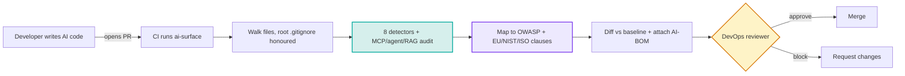

<div align="center">

# ai-surface

**Find the AI attack surface your code is about to ship. Locally, offline, before the PR merges.**

[](https://opensource.org/licenses/MIT)
[](https://www.python.org/downloads/)
[](CHANGELOG.md)
[](tests/)
[](docs/PRIVACY.md)

</div>

`ai-surface` is a static analyzer that maps the AI in your codebase: LLM calls, agents, MCP servers, RAG and vector stores, model gateways, self-hosted runtimes, and the HTTP APIs that expose them. Run it on your laptop or in CI. It inventories every AI component a change introduces, flags risk indicators (and assigns severity where the deep-dive audit has enough evidence), and can **fail the build** when a PR introduces a new risk.

It runs entirely on your machine. No network calls, no telemetry, no credentials. Your source never leaves the host.

```bash
uvx ai-surface scan .          # one-off, no install
ai-surface scan . --ui         # explore it as an interactive map
```

It also generates an **AI-BOM** and maps findings to the OWASP LLM Top 10 and the EU AI Act, NIST AI RMF, and ISO 42001 (see [Compliance](#compliance-and-governance)). Runtime exploit validation is out of scope for this OSS scanner; it maps and audits the surface statically.

<div align="center">


<sub>The <code>--ui</code> map: every detected AI surface as a node, grouped by category, served on loopback.</sub>

</div>

## Who is this for?

Use `ai-surface` if you are:

- adding agents, MCP servers, RAG, or LLM calls to an application
- reviewing AI-related pull requests
- building an AI-BOM or an AI-governance inventory
- trying to understand where AI risk enters your codebase

Built for DevSecOps, AppSec, and platform teams.

## Table of Contents

- [Who is this for?](#who-is-this-for)
- [Quick start](#quick-start)
- [What it detects](#what-it-detects)
- [Proven on real code](#proven-on-real-code)
- [GitHub Action and CI gating](#github-action-and-ci-gating)
- [Output formats](#output-formats)
- [CLI reference](#cli-reference)
- [Compliance and governance](#compliance-and-governance)
- [How it works](#how-it-works)
- [Comparison with adjacent tools](#comparison-with-adjacent-tools)
- [What it does not do](#what-it-does-not-do)
- [Roadmap](#roadmap)
- [Runtime validation](#runtime-validation)
- [Development](#development)
- [License](#license)

## Quick start

```bash
# One-off, no install (recommended first run)
uvx ai-surface scan .

# Install globally for a long-lived CLI
pipx install ai-surface
ai-surface scan .

# Or in a project venv
pip install ai-surface && ai-surface scan .

# Explore the results visually
ai-surface scan . --ui
```

Requires Python 3.9+. The CLI scan runs 100% locally; `--ui` serves on loopback only.

### What a scan looks like

```text
AI Attack Surface Report
------------------------------------------------------------------
Scanned: lumora
19 AI surfaces  |  6 categories  |  8 assessed for risk

MCP SERVERS  (discovery + deep-dive audit)
  - payments-mcp                                          [CRITICAL]
      [!] secrets-in-env     secret in MCP env block      (LLM02, EU Art. 15)
      [!] financial-action   exposes refund / payout      (LLM06, EU Art. 9)
      [!] no-human-oversight no approval gate on payout    (EU Art. 14)

AGENT FRAMEWORKS
  - LangChain Agent: support_agent (backend/app/ai/support_agent.py)
      tools: process_refund, lookup_order, send_email, search_knowledge
      [!] high-blast-radius  read AND financial/destructive tools
      [!] pii-to-llm         customer email/address in the prompt  (EU Art. 10)

VECTOR / RAG
  - RAG pipeline: LangChain  +  Vector store: pgvector
      [!] ingests external content (RAG poisoning surface) (LLM08)

API ENDPOINTS
  - GET   /customers/{customer_id}    [!] object-id in path (BOLA candidate)
  - PATCH /customers/{customer_id}    [!] object-id in path (BOLA candidate)
------------------------------------------------------------------
```

### First run on a mature repo

The first scan surfaces everything already shipping. The pattern that scales:

```bash
ai-surface scan . --update-baseline           # 1. snapshot today's inventory
ai-surface scan . --baseline                  # 2. then show only what changed
ai-surface scan . --baseline --fail-on high   # 3. in CI, fail only on NEW high+ risk
```

`--baseline --fail-on high` is the recommended PR gate: low-noise, non-blocking on pre-existing debt, and actionable.

## What it detects

Eight categories, one per detector. Configuration, keys, and specs are detected on **any stack**; deep code-level detection is strongest on **Python and TypeScript/JavaScript** (full matrix in [`docs/LANGUAGE_SUPPORT.md`](docs/LANGUAGE_SUPPORT.md)).

| Category | Coverage | What it finds |
|---|---|---|
| **Agent frameworks** | 10 Python + 6 JS/TS | LangChain, LangGraph, CrewAI, LlamaIndex, AutoGen, Haystack, Semantic Kernel, Pydantic AI, AWS Strands; LangChain.js, LangGraph.js, Vercel AI SDK, Mastra, OpenAI Agents, LlamaIndex.ts. Extracts each agent's **tool inventory** and flags financial / destructive / high-blast-radius authority. |
| **MCP servers** | Discovery + deep-dive audit | Configured (`.mcp.json`) and in-house source servers. Each gets a severity, risk flags with remediation, detected secrets (name and type only, never values), and registry/trust signals. |
| **Vector stores / RAG** | 13 stores + 2 frameworks | Pinecone, Weaviate, Chroma, Qdrant, Milvus, FAISS, LanceDB, pgvector, Elasticsearch/OpenSearch/Vespa/Redis (vector mode), plus LangChain / LlamaIndex pipelines. Flags managed-store egress, the RAG data flow, embeddings, and external ingestion. |
| **LLM SDK call sites** | 13 providers | Anthropic, OpenAI, Azure OpenAI, AWS Bedrock (direct + Strands), Google Generative AI, Vertex AI, Together, Mistral, Cohere, Replicate, Groq, LiteLLM, Vercel AI SDK. Models extracted, non-literal data flow flagged. |
| **API endpoints** | HTTP/REST + OpenAPI | OpenAPI/Swagger specs and framework routes (FastAPI/Starlette, Flask, Express, Spring, Django). Captures method, path, auth style, and flags a **BOLA candidate** on object-id path segments. |
| **Model gateways** | Configs + source | LiteLLM proxy, Portkey, Helicone, Cloudflare AI Gateway, OpenRouter. |
| **AI infrastructure** | Manifests + IaC | K8s/Helm/compose workloads (ollama, vllm, TGI, etc.), AI-runtime Dockerfiles, Terraform Bedrock/SageMaker/Vertex endpoints. |
| **AI provider keys** | Names only | `OPENAI_API_KEY`, `ANTHROPIC_API_KEY`, etc. across `.env` files. Never reads values. |

Inventory categories carry no invented severity; severity comes only from the deep-dive audit layers (MCP, agents, RAG). See [`docs/DETECTORS.md`](docs/DETECTORS.md) for every pattern matched.

## Proven on real code

We statically scanned 19 of the most popular open-source AI projects on GitHub (AutoGPT, Dify, RAGFlow, AutoGen, CrewAI, LlamaIndex, Continue, Danswer, and more). Scan only: each repo was cloned shallow, scanned, and deleted. No app was run, no code left the host. Across the 12 applications in that set:

| Signal | Apps |
|---|---|
| Ship AI agents | 83% |
| Have a vector store / RAG layer | 83% |
| Expose API endpoints with BOLA candidates | 67% |
| Expose MCP servers | 42% |
| Run an agent/MCP surface with no observability wired | 33% |

These are category-presence numbers, which are the reliable signal; raw per-component counts are indicative only. Full methodology, per-app appendix, and the honest caveats are in the [State of AI Surface](docs/STATE_OF_AI_SURFACE.md) report.

<div align="center">


</div>

## GitHub Action and CI gating

Drop this into `.github/workflows/ai-surface.yml`:

```yaml
name: AI Surface Check
on: [pull_request]

permissions:
  contents: read
  pull-requests: write

jobs:
  ai-surface:
    runs-on: ubuntu-latest
    steps:
      - uses: actions/checkout@v4
        with: { fetch-depth: 0 }    # required for base-vs-head diff
      - uses: apisec-inc/AI-Surface@v1
        with:
          path: '.'
          comment-on-pr: 'true'
          fail-on: 'high'           # fail only on NEW high-or-critical findings
```

Every PR gets a sticky comment showing what changed in this PR, not just current state. `fail-on` gates on **assessed severity**, so inventory never trips it and the build only fails when a PR introduces a new finding at or above the threshold. On a PR it gates on newly introduced findings only; on a push it gates on current state. The CI log prints the offending finding, file, and remediation.

In any non-GitHub CI, the gate is just an exit code:

```bash
ai-surface scan . --fail-on high   # exit 1 if any critical/high finding
```

See [`docs/CI_INTEGRATION.md`](docs/CI_INTEGRATION.md) for policy files, thresholds, and multi-repo rollups.

## Output formats

```bash
ai-surface scan .                      # rich terminal output
ai-surface scan . --ui                 # interactive map in a local browser
ai-surface scan . --output json        # machine-readable JSON (schema 1.0)
ai-surface scan . --output markdown    # markdown report
ai-surface scan . --output cyclonedx   # CycloneDX AI-BOM (governance artifact)
ai-surface scan . --output sarif       # SARIF 2.1.0 for GitHub code scanning
ai-surface scan . --write-inventory    # writes .ai-inventory.md to the scan root
ai-surface scan . --quiet              # one-line summary for CI
```

- **CycloneDX** is your AI-BOM, generated in CI the way you already generate an SBOM, with the governance mappings attached.
- **SARIF** uploads to the GitHub Security tab and shows as inline PR annotations.
- The **`--ui` viewer** serves over `127.0.0.1` from a throwaway temp directory. No scanning in the browser, no egress, no telemetry.

## CLI reference

```bash
# Scan and report
ai-surface scan .                          # pretty terminal
ai-surface scan . --ui                     # interactive map
ai-surface scan . --output json|markdown|cyclonedx|sarif

# Filter to categories  (aliases: mcp, agents, llm, gateway, infra, keys, api, vector)
ai-surface scan . --categories mcp,agents  # MCP + agents only
ai-surface scan . --categories vector      # vector stores / RAG only

# CI gate: severity threshold, exit code 1 at or above it
ai-surface scan . --fail-on high           # fail on critical/high
ai-surface scan . --fail-on-risk           # aggressive: any risk indicator

# Baseline mode: snapshot, then show only what is NEW
ai-surface scan . --update-baseline        # writes .ai-surface-baseline.json
ai-surface scan . --baseline               # diff vs the snapshot
ai-surface scan . --baseline --fail-on high  # the recommended PR gate

# Compare two scans (used by the GitHub Action under the hood)
ai-surface compare base.json head.json     # markdown diff
```

## Compliance and governance

Every audited finding maps to the **OWASP LLM Top 10** and to the specific **EU AI Act / NIST AI RMF / ISO 42001** clauses it evidences. The UI shows these as badges; the JSON and CycloneDX outputs carry them as structured data. The CycloneDX output is your AI-BOM.

`ai-surface` produces evidence; it does not certify compliance. A framework requirement is only reported when the scan actually produced that kind of evidence.

<div align="center">


</div>

### What each framework gets from a scan

| Framework | Inventory | Risk | Human oversight | Logging | Data governance |
|---|:--:|:--:|:--:|:--:|:--:|
| EU AI Act | Art. 11-12 | Art. 9 | Art. 14 | Art. 12 | Art. 10 |
| NIST AI RMF | MAP | MEASURE | n/a | MEASURE 3 | MEASURE |
| ISO/IEC 42001 | Annex A | Risk assessment | n/a | A.6.2.6 | A.7 |
| OWASP LLM Top 10 | per-finding LLM01-LLM10 mapping | | | | |

### How risk flags map to clauses

| Risk flag | OWASP | EU AI Act | NIST | ISO 42001 |
|---|---|---|---|---|
| `secrets-detected` / `secrets-in-env` | LLM02 | Art. 15 | | |
| `financial-action` / `destructive-action` / `high-blast-radius` | LLM06 | Art. 9 | | |
| `no-human-oversight` | LLM06 / LLM09 | Art. 14 | | |
| `no-observability` | | Art. 12 | MEASURE 3 | A.6.2.6 |
| `pii-to-llm` | LLM02 | Art. 10 | | A.7 |
| `unverified-source` / `remote-mcp` | LLM03 | | | A.10 |
| vector store / RAG present | LLM08 | Art. 10 | data | A.7 |

Full detail, including the honesty boundary, is in [`docs/COMPLIANCE.md`](docs/COMPLIANCE.md).

## How it works

`ai-surface` is a static source-code analyzer. It reads files, pattern-matches against known AI-surface signatures, runs the deep-dive audit and governance-mapping passes, and produces a report. No code execution, no network calls, no credentials.



The only network call in the whole project is the GitHub Action posting a PR comment via a token your workflow provides. Local CLI runs are 100% offline. Deep dive: [`docs/ARCHITECTURE.md`](docs/ARCHITECTURE.md).

## Comparison with adjacent tools

| Tool | What it tells you | When it sees AI |
|---|---|---|
| SAST (Semgrep, CodeQL) | Code-pattern vulnerabilities | After commit; doesn't index AI surfaces |
| DAST (Burp, ZAP) | Reachable web vulnerabilities | After deploy; sees HTTP, not LLM internals |
| SCA (Snyk, Dependabot) | Vulnerable dependencies | After commit; sees packages, not usage |
| Observability (Helicone, LangSmith) | What LLM calls happened | After deploy; runtime traffic |
| AI-BOM tools (Cisco AI Defense) | Inventory of AI components | Often runtime/cloud; no PR gate |
| **ai-surface** | **What AI attack surface is about to ship, mapped to governance** | **At PR time, before merge, offline** |
| APIsec platform | Which AI surfaces are actually exploitable | PR time + runtime; replayable evidence |

`ai-surface` does not replace any of these. It focuses on the PR-time AI-attack-surface gap that most adjacent tools do not cover directly.

## What it does not do

- **Runtime telemetry or behavior monitoring.** Use Helicone, LangSmith, Arize, Phoenix.
- **Runtime exploit validation.** It maps and audits statically; it does not prove exploitability against a running app (see [Runtime validation](#runtime-validation)).
- **Prompt injection / jailbreak / bias / accuracy testing.** Out of scope by design, permanently. It is a structural analyzer, not a model evaluator.
- **Full cross-file dataflow for tool resolution.** Regex/AST-light today; agent tools built by factory functions are not yet resolved, so the deep audit can under-fire on large platforms. Treat the map as a strong floor, not a proof of completeness. AST/dataflow is the top roadmap item.
- **Secret-value reads or PII classification.** Secrets are reported by name and type only, values redacted. Use a dedicated secret scanner for value-level coverage.

## Roadmap

| Version | Status | What's in it |
|---|---|---|
| v1.0 | Shipped | 8-category mapping, MCP + agent + RAG audits, OWASP + EU/NIST/ISO governance mapping, AI-BOM + SARIF, interactive `--ui` map, frozen schema 1.0, GitHub Action with PR diff comments, `--baseline` and `--fail-on` gates. |
| Fast-follow | Planned | AST / cross-file dataflow for tool resolution, `.ai-surface.yml` policy file, GitLab CI component. |
| Later | Planned | kubectl plugin, live cluster discovery, continuous mode + drift alerts, multi-repo rollup, plugin SDK. |

## Runtime validation

<a id="runtime-validation"></a>

`ai-surface` tells you what AI attack surface exists and how risky it looks statically. To validate which surfaces are actually **exploitable** in a running application (agent-to-tool authorization, integration-chain exploits, BOLA across the agent layer, with replayable evidence), see [APIsec](https://apisec.ai/ai-validation).

| Source surface | Paid destination |
|---|---|
| AI / agent surfaces | agent validation |
| MCP servers | MCP runtime validation |
| Discovered APIs | API outside-in runtime testing |

The disconnect between free discovery and paid runtime validation is intentional: bridges are an upgrade path, not an integration. No finding data leaves your machine; the bridge is a deep link.

## Development

```bash
git clone https://github.com/apisec-inc/AI-Surface
cd AI-Surface
python -m venv .venv && source .venv/bin/activate
pip install -e ".[dev]"
pytest                       # 341 tests
ruff check src/ tests/       # lint
mypy src/                    # types
```

Adding a detector: implement the `Detector` protocol in `types.py`, register it in `default_detectors()`, add fixtures and tests under `tests/`. The report shape is frozen in [`docs/SCHEMA_v1.md`](docs/SCHEMA_v1.md). See [CONTRIBUTING.md](CONTRIBUTING.md).

## Project

| Resource | Link |
|---|---|
| Detectors | [docs/DETECTORS.md](docs/DETECTORS.md) |
| Compliance mapping | [docs/COMPLIANCE.md](docs/COMPLIANCE.md) |
| Language support | [docs/LANGUAGE_SUPPORT.md](docs/LANGUAGE_SUPPORT.md) |
| Architecture | [docs/ARCHITECTURE.md](docs/ARCHITECTURE.md) |
| CI integration | [docs/CI_INTEGRATION.md](docs/CI_INTEGRATION.md) |
| Report schema | [docs/SCHEMA_v1.md](docs/SCHEMA_v1.md) |
| State of AI Surface | [docs/STATE_OF_AI_SURFACE.md](docs/STATE_OF_AI_SURFACE.md) |
| Privacy | [docs/PRIVACY.md](docs/PRIVACY.md) |
| Changelog | [CHANGELOG.md](CHANGELOG.md) |

## License

MIT. See [LICENSE](LICENSE).

---

<div align="center">

Built by [APIsec](https://apisec.ai). Part of the APIsec Labs OSS family.

</div>
