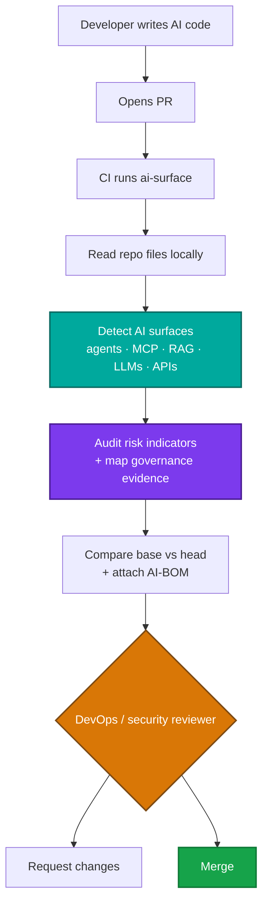

<div align="center">

# ai-surface

**Find the AI attack surface your code is about to ship. Locally, offline, before the PR merges.**

[](https://opensource.org/licenses/MIT)
[](https://www.python.org/downloads/)
[](https://github.com/apisec-inc/AI-Surface/blob/main/CHANGELOG.md)
[](https://github.com/apisec-inc/AI-Surface/tree/main/tests)
[](https://github.com/apisec-inc/AI-Surface/blob/main/docs/PRIVACY.md)

</div>

`ai-surface` maps the AI attack surface in your codebase: LLM calls, agents, MCP servers, RAG/vector stores, model gateways, self-hosted runtimes, provider keys, and the HTTP APIs that expose them. Run it locally or in CI to see what AI surfaces a PR introduces, generate an AI-BOM, and gate new high-risk findings before merge.

It runs as a local static analysis pass that executes no code, makes no network calls, sends no telemetry, and requires no credentials, so your source never leaves the host.

Try it without installing:

```bash
uvx --from apisec-ai-surface ai-surface scan .
```

Findings map to the OWASP LLM Top 10 and the EU AI Act, NIST AI RMF, and ISO 42001, so the AI-BOM doubles as governance evidence (see [Compliance](#compliance-and-governance)). Runtime exploit validation is out of scope for this OSS scanner.

<div align="center">


<sub>The optional <code>--ui</code> map shows detected AI surfaces as nodes grouped by category. It is served on loopback and runs locally.</sub>

</div>

## Who is this for?

Use `ai-surface` if you are:

- adding agents, MCP servers, RAG, model gateways, or LLM calls to an application
- reviewing AI-related pull requests before they merge
- adding an AI risk gate to CI/CD
- building an AI-BOM or AI-governance inventory from source code
- trying to understand where AI risk enters your codebase

Built for DevOps, DevSecOps, platform engineering, AppSec, and security-minded engineering teams.

## Table of Contents

- [Who is this for?](#who-is-this-for)
- [Quick start](#quick-start)
- [What the output looks like](#what-the-output-looks-like)
- [First run on a mature repo](#first-run-on-a-mature-repo)
- [GitHub Action and CI gating](#github-action-and-ci-gating)
- [Open the local UI](#open-the-local-ui)
- [What it detects](#what-it-detects)
- [Proven on real code](#proven-on-real-code)
- [Output formats](#output-formats)
- [CLI reference](#cli-reference)
- [Compliance and governance](#compliance-and-governance)
- [How it works](#how-it-works)
- [Comparison with adjacent tools](#comparison-with-adjacent-tools)
- [What it does not do](#what-it-does-not-do)
- [Roadmap](#roadmap)
- [Runtime validation](#runtime-validation)
- [Development](#development)
- [Project](#project)
- [License](#license)

## Quick start

Install once, then run `ai-surface` anywhere:

```bash
pipx install apisec-ai-surface
ai-surface scan .

# or run once with no install
uvx --from apisec-ai-surface ai-surface scan .

# or in a project venv
pip install apisec-ai-surface && ai-surface scan .

# explore the results visually
ai-surface scan . --ui
```

Requires Python 3.9+. The CLI runs locally; `--ui` serves on loopback only.

### What the output looks like

Reproduce a full multi-category report yourself on the bundled demo app: `ai-surface scan examples/demo-app` (add `--ui` for the interactive map). The report below is from a representative AI app.

```text
AI Attack Surface Report
────────────────────────────────────────────────────────────────
Project:    lumora
Repository: apisec-inc/lumora
19 production AI surfaces · 25 risk indicators · across 8 detector(s)
Severity: 6 high · 2 medium

AGENT FRAMEWORKS
  • LangChain Agent: agent (in backend/app/ai/support_agent.py) [HIGH]
      Tools/perms: process_refund, lookup_order, send_email, update_address, search_knowledge
      ⚠ financial action exposed   ⚠ messaging action exposed   ⚠ high blast-radius combination
      ⚑ [HIGH] financial-action
        Agent can invoke financial tools (process_refund)
        OWASP: LLM06
        Governance: EU AI Act Art. 9
        Fix: Gate financial tools behind human approval; least-privilege the agent.
      ⚑ [HIGH] no-human-oversight
        High-risk action runs with no human approval / in-the-loop gate detected
        OWASP: LLM06, LLM09
        Governance: EU AI Act Art. 14
      ⚑ [MEDIUM] pii-to-llm
        Personal data (PII) is interpolated into a prompt template sent to the model
        OWASP: LLM02
        Governance: EU AI Act Art. 10, ISO 42001 A.7
      → validate at runtime: agent validation in APIsec
  • Mastra Agent: inventory (in assistant/src/inventory-agent.ts) [HIGH]
      Tools/perms: checkStock, reorder, deleteSku
      ⚑ [HIGH] destructive-action
        Agent can invoke destructive tools (deleteSku)
        OWASP: LLM06    Governance: EU AI Act Art. 9

MCP SERVERS
  • MCP Server: payments-mcp [HIGH]   Trust: verified (90/100)
      ⚑ [HIGH] secrets-in-env
        Environment variables in the config appear to hold sensitive credentials
        OWASP: LLM02, LLM07    Governance: EU AI Act Art. 15
      ⚑ [HIGH] financial-action
        MCP exposes financial tools (refund, charge, payout) to the model
        OWASP: LLM06    Governance: EU AI Act Art. 9
      ⚑ [MEDIUM] unverified-source
        MCP is not from a known/verified publisher
        OWASP: LLM03    Governance: ISO 42001 A.10
  • MCP Server: db-mcp [HIGH]
      ⚑ [HIGH] database-access      MCP can query or modify database contents      OWASP: LLM06
  • MCP Server: filesystem-mcp [HIGH]
      ⚑ [HIGH] filesystem-access    MCP can read/write files on the host           OWASP: LLM06

VECTOR-STORE
  • Vector store: pgvector  ·  RAG pipeline: LangChain   (backend/app/ai/knowledge.py)
      ⚠ retrieved content reaches the model (retrieval-augmented generation)
      ⚠ ingests external content (RAG poisoning surface)

LLM SDK CALL SITES
  • OpenAI SDK · gpt-4o · backend/app/ai/llm.py        ⚠ non-literal data flows into LLM call
  • AWS Bedrock · us.anthropic.claude-sonnet-4 · backend/app/ai/llm.py

API ENDPOINTS
  • GET   /customers/{customer_id}     ⚠ object-id in path (BOLA candidate)
  • PATCH /customers/{customer_id}     ⚠ object-id in path (BOLA candidate)
```

### First run on a mature repo

The first run maps the AI surfaces already present in the codebase. The pattern that scales is to baseline existing surfaces, then gate only new high-risk findings in pull requests:

```bash
ai-surface scan . --update-baseline           # 1. snapshot today's inventory
ai-surface scan . --baseline                  # 2. show only what changed
ai-surface scan . --baseline --fail-on high   # 3. in CI, fail only on NEW high+ risk
```

`--baseline --fail-on high` is the recommended PR gate: low-noise, non-blocking on pre-existing debt, and actionable.

## GitHub Action and CI gating

Drop this into `.github/workflows/ai-surface.yml`:

```yaml
name: AI Surface Check
on: [pull_request]

permissions:
  contents: read
  pull-requests: write   # required when comment-on-pr is true

jobs:
  ai-surface:
    runs-on: ubuntu-latest
    steps:
      - uses: actions/checkout@v4
        with:
          fetch-depth: 0   # required for base-vs-head diff
      - uses: apisec-inc/AI-Surface@v1
        with:
          path: '.'
          comment-on-pr: 'true'
          fail-on: 'high'  # fail only on NEW high-or-critical findings
```

Every PR gets a sticky comment showing what changed in the PR, not just the current repo state. `fail-on` gates on assessed severity, so inventory-only findings do not fail the build. With `fail-on: high`, the build fails only when the PR introduces a new high-or-critical finding.

No API keys are required. The action uses the built-in `GITHUB_TOKEN` to post or update the PR comment.

For non-GitHub CI, the gate is just an exit code:

```bash
ai-surface scan . --fail-on high
```

See [`docs/CI_INTEGRATION.md`](https://github.com/apisec-inc/AI-Surface/blob/main/docs/CI_INTEGRATION.md) for permissions, fork PR behavior, baseline options, SARIF upload, policy files, and multi-repo rollups.

## Open the local UI

After installing `ai-surface`, you can open the interactive AI attack-surface map from any repo:

```bash
ai-surface scan . --ui
```

The UI shows detected AI surfaces as nodes grouped by category, with risk indicators, governance badges, evidence, and AI-BOM download where available.

The UI is served locally over `127.0.0.1` from a temporary directory.

The analysis never runs in the browser, your source code never leaves your machine, and no telemetry is collected.

To stop the local UI server, press `Ctrl-C` in the terminal.

## What it detects

`ai-surface` looks for eight categories of AI surface. Configuration files, provider keys, manifests, and specs are detected across stacks; deeper code-level detection is strongest today for Python and TypeScript/JavaScript. See [`docs/LANGUAGE_SUPPORT.md`](https://github.com/apisec-inc/AI-Surface/blob/main/docs/LANGUAGE_SUPPORT.md) for the full matrix.

| Category | Coverage | What it finds |
|---|---|---|
| Agent frameworks | 10 Python + 6 JS/TS frameworks | LangChain, LangGraph, CrewAI, LlamaIndex, AutoGen, Haystack, Semantic Kernel, Pydantic AI, AWS Strands, LangChain.js, LangGraph.js, Vercel AI SDK, Mastra, OpenAI Agents, and LlamaIndex.ts. Extracts agent tool inventories and flags financial, destructive, and high-blast-radius authority. |
| MCP servers | Discovery + deep-dive audit | Configured MCP servers such as `.mcp.json` entries and in-house source servers. Audited findings include risk flags, remediation, detected secrets by name/type only, and registry/trust signals. |
| Vector stores / RAG | 13 stores + 2 frameworks | Pinecone, Weaviate, Chroma, Qdrant, Milvus, FAISS, LanceDB, pgvector, Elasticsearch/OpenSearch/Vespa/Redis in vector mode, plus LangChain and LlamaIndex retrieval pipelines. Flags managed-store egress, RAG data flow, embeddings, and external ingestion. |
| LLM SDK call sites | 13 providers | Anthropic, OpenAI, Azure OpenAI, AWS Bedrock, Google Generative AI, Vertex AI, Together, Mistral, Cohere, Replicate, Groq, LiteLLM, and Vercel AI SDK. Extracts models where visible and flags non-literal prompt/message flow. |
| API endpoints | HTTP/REST + OpenAPI | OpenAPI/Swagger specs and framework routes including FastAPI, Starlette, Flask, Express, Spring, and Django. Captures method, path, framework, auth style, and object-id path segments that may need BOLA review. |
| Model gateways | Configs + source | LiteLLM proxy, Portkey, Helicone, Cloudflare AI Gateway, and OpenRouter. Captures routed-model inventories where visible. |
| AI infrastructure | Manifests + IaC | Kubernetes, Helm, Docker Compose, Dockerfiles, and Terraform for AI runtimes and managed AI services such as Ollama, vLLM, TGI, SGLang, Triton, llama.cpp, Bedrock, SageMaker, and Vertex endpoints. |
| AI provider keys | Names only | Common provider key names such as `OPENAI_API_KEY`, `ANTHROPIC_API_KEY`, and `AZURE_OPENAI_*` across environment files and config. Values are never read or printed. |

Inventory categories do not get severity by default. Severity is assigned only when the deep-dive audit has enough evidence, currently in MCP, agent, and RAG findings. See [`docs/DETECTORS.md`](https://github.com/apisec-inc/AI-Surface/blob/main/docs/DETECTORS.md) for every pattern matched.

## Proven on real code

We tested `ai-surface` against 19 popular open-source AI projects on GitHub, representing about 941k combined stars at the time of analysis. The set included AutoGPT, Dify, RAGFlow, AutoGen, CrewAI, LlamaIndex, Continue, Danswer, and others.

This was a static, offline analysis only: each repo was shallow-cloned, analyzed locally, and deleted. No application was run. No code left the host.

The set split into 12 applications and 7 framework/library repos. Frameworks and libraries are reported separately because they often include many integrations as code paths, so their raw component counts are not comparable to applications.

Across the 12 application repos, `ai-surface` found:

| Signal | Apps |
|---|---|
| Ship AI agents | 83% |
| Have a vector store / RAG layer | 83% |
| Expose API endpoints | 83% |
| Have API endpoints that may need BOLA review | 67% |
| Expose MCP servers | 42% |
| Run an agent/MCP surface with no observability wired | 33% |
| Interpolate PII into prompts | 17% |
| Trip at least one risk and one governance rule | 100% |

These are category-presence signals, not exploitability claims. The numbers are a floor, not a ceiling: tool resolution is regex/AST-light today, so some agent/tool risks can under-fire on larger platforms. Raw per-component counts are useful for investigation but can vary by framework, coding style, and detector coverage.

Full methodology, per-app appendix, framework/library appendix, and caveats are in the [State of AI Surface](https://github.com/apisec-inc/AI-Surface/blob/main/docs/STATE_OF_AI_SURFACE.md) report.

<div align="center">


</div>

## Output formats

```bash
ai-surface scan .                      # terminal report
ai-surface scan . --ui                 # interactive map in a local browser
ai-surface scan . --output json        # machine-readable JSON (schema 1.0)
ai-surface scan . --output markdown    # human-readable Markdown report
ai-surface scan . --output cyclonedx   # CycloneDX AI-BOM
ai-surface scan . --output sarif       # SARIF 2.1.0 for GitHub code scanning
ai-surface scan . --write-inventory    # write .ai-inventory.md to the project root
ai-surface scan . --quiet              # one-line CI summary
```

CycloneDX output is the AI-BOM: an inventory artifact generated in CI the way teams already generate SBOMs, with AI governance mappings attached.

SARIF output can be uploaded to GitHub code scanning for Security tab visibility and inline PR annotations.

The `--ui` viewer serves over `127.0.0.1` from a throwaway temp directory; the analysis never runs in the browser, nothing is sent off your machine, and there is no telemetry.

## CLI reference

```bash
# Map the current project
ai-surface scan .

# Open the local interactive map
ai-surface scan . --ui

# Produce machine-readable or human-readable output
ai-surface scan . --output json
ai-surface scan . --output markdown
ai-surface scan . --output cyclonedx
ai-surface scan . --output sarif

# Filter to specific categories
# aliases: mcp, agents, llm, gateway, infra, keys, api, vector
ai-surface scan . --categories mcp,agents
ai-surface scan . --categories vector

# Gate CI by assessed severity
ai-surface scan . --fail-on high       # fail on high or critical findings
ai-surface scan . --fail-on critical   # fail only on critical findings

# Aggressive gate: fail on any risk indicator
ai-surface scan . --fail-on-risk

# Baseline existing AI surfaces, then show only what changed
ai-surface scan . --update-baseline
ai-surface scan . --baseline
ai-surface scan . --baseline --fail-on high

# Compare two reports
ai-surface compare base.json head.json
```

## Compliance and governance

`ai-surface` maps audited findings to the OWASP LLM Top 10 and to evidence-relevant clauses in the EU AI Act, NIST AI RMF, and ISO/IEC 42001.

The UI shows these mappings as badges. JSON output carries them as structured `standards` fields. CycloneDX output carries them as component properties, making it your AI-BOM artifact.

`ai-surface` produces evidence; it does not certify, attest, or assert compliance. A framework requirement is reported only when the analysis produced that kind of evidence.

<div align="center">


</div>

### What the mappings cover

| Evidence kind | Examples | Framework use |
|---|---|---|
| Inventory | agents, MCP servers, RAG/vector stores, LLM calls, gateways, AI infra | AI-BOM, system documentation, governance inventory |
| Risk | financial tools, destructive tools, high-blast-radius agents, secret-bearing MCP config | risk review and assessment evidence |
| Human oversight | high-risk action with no detected approval gate | EU AI Act Art. 14 review signal |
| Logging / monitoring | agent or MCP execution surface with no detected tracing | EU AI Act Art. 12, NIST MEASURE 3, ISO A.6.2.6 evidence |
| Data governance | RAG/vector layer, PII interpolated into prompts | EU AI Act Art. 10, ISO A.7 evidence |

### Example risk-flag mappings

| Risk flag | OWASP | EU AI Act | NIST AI RMF | ISO/IEC 42001 |
|---|---|---|---|---|
| `secrets-in-env` | LLM02 | Art. 15 | - | - |
| `financial-action` / `destructive-action` / `high-blast-radius` | LLM06 | Art. 9 | - | - |
| `no-human-oversight` | LLM06 / LLM09 | Art. 14 | - | - |
| `no-observability` | - | Art. 12 | MEASURE 3 | A.6.2.6 |
| `pii-to-llm` | LLM02 | Art. 10 | - | A.7 |
| `unverified-source` / `remote-mcp` / `local-binary` | LLM03 | - | - | A.10 |
| vector store / RAG present | LLM08 | Art. 10 | data | A.7 |

The reported footprint is a floor, not a ceiling: static analysis can miss risks in code that builds tools dynamically or through factory functions.

Full mapping details, caveats, and AI-BOM generation guidance are in [`docs/COMPLIANCE.md`](https://github.com/apisec-inc/AI-Surface/blob/main/docs/COMPLIANCE.md).

## How it works

`ai-surface` maps AI surfaces from source code and configuration. It reads files, matches known AI-surface signatures, runs deep-dive audits where enough evidence exists, attaches governance mappings, and produces reports for developers, CI systems, and security teams.



The CLI executes no code, uses no credentials, sends no telemetry, and makes no network calls.

When PR comments are enabled, the GitHub Action uses the repository's `GITHUB_TOKEN` to post or update a comment through the GitHub API. It does not send source code, findings, or metadata to APIsec.

Deep dive: [`docs/ARCHITECTURE.md`](https://github.com/apisec-inc/AI-Surface/blob/main/docs/ARCHITECTURE.md).

## Comparison with adjacent tools

| Tool | What it tells you | When it sees AI |
|---|---|---|
| SAST (Semgrep, CodeQL) | Code-pattern vulnerabilities | After commit; usually does not build an AI surface inventory |
| DAST (Burp, ZAP) | Reachable web vulnerabilities | After deploy; sees HTTP behavior, not LLM/agent internals |
| SCA (Snyk, Dependabot) | Vulnerable dependencies | After commit; sees packages, not how AI components are used |
| Observability (Helicone, LangSmith, Arize, Phoenix) | What LLM calls happened at runtime | After deploy; requires runtime traffic |
| AI-SPM / AI governance tools | Cloud/runtime AI inventory and posture | Often runtime/cloud-first; not usually a local PR-time gate |
| **`ai-surface`** | **What AI attack surface is about to ship, mapped to governance evidence** | **At PR time, before merge, offline** |
| APIsec platform | Which AI/API surfaces are actually exploitable | Runtime validation with replayable evidence |

`ai-surface` does not replace these tools. It focuses on the local, PR-time AI attack-surface gap that most adjacent tools do not cover directly.

## What it does not do

- **Runtime telemetry or behavior monitoring.** Use tools like Helicone, LangSmith, Arize, or Phoenix.
- **Runtime exploit validation.** `ai-surface` maps and audits statically; it does not prove exploitability against a running app (see [Runtime validation](#runtime-validation)).
- **Prompt injection, jailbreak, bias, or accuracy testing.** Out of scope by design. `ai-surface` is a structural analyzer, not a model evaluator.
- **Full cross-file dataflow for tool resolution.** Regex/AST-light today; agent tools built through factory functions may not be fully resolved. Treat the map as a strong floor, not proof of complete coverage. AST/dataflow is the top roadmap item.
- **Secret-value reads or PII classification.** Secrets are reported by name and type only, with values redacted. Use a dedicated secret scanner for value-level coverage.

## Roadmap

| Version | Status | What's in it |
|---|---|---|
| v1.0 | Shipped | 8-category mapping, MCP + agent + RAG audits, OWASP + EU/NIST/ISO governance mapping, AI-BOM + SARIF, interactive `--ui` map, frozen schema 1.0, GitHub Action with PR diff comments, `--baseline` and `--fail-on` gates. |
| Fast-follow | Planned | AST / cross-file dataflow for tool resolution, `.ai-surface.yml` policy file, GitLab CI component. |
| Later | Planned | kubectl plugin, live cluster discovery, continuous mode + drift alerts, multi-repo rollup, plugin SDK. |

## Runtime validation

<a id="runtime-validation"></a>

`ai-surface` maps AI attack surfaces from source code and configuration. It identifies where agents, MCP servers, RAG paths, LLM calls, gateways, infrastructure, provider keys, and AI-exposed APIs exist, and flags risk indicators where static evidence is present.

It does not prove exploitability against a running application.

For runtime validation with replayable evidence, see [APIsec](https://www.apisec.ai/products):

| Source surface | Runtime validation path |
|---|---|
| AI / agent surfaces | agent validation |
| MCP servers | MCP runtime validation |
| Discovered APIs | API outside-in runtime testing |

The boundary is intentional: free local discovery here, runtime exploit validation in APIsec. Bridges are an upgrade path, not a data-sharing integration. No finding data leaves your machine; the bridge is a deep link.

## Development

```bash
git clone https://github.com/apisec-inc/AI-Surface
cd AI-Surface
python -m venv .venv
source .venv/bin/activate
pip install -e ".[dev]"
pytest                       # tests
ruff check src/ tests/       # lint
mypy src/                    # types
```

To add a detector, implement the `Detector` protocol in `types.py`, register it in `default_detectors()`, and add fixtures and tests under `tests/`.

The report shape is frozen in [`docs/SCHEMA_v1.md`](https://github.com/apisec-inc/AI-Surface/blob/main/docs/SCHEMA_v1.md). See [CONTRIBUTING.md](https://github.com/apisec-inc/AI-Surface/blob/main/CONTRIBUTING.md) for contributor guidance.

## Project

| Resource | Link |
|---|---|
| Detectors | [docs/DETECTORS.md](https://github.com/apisec-inc/AI-Surface/blob/main/docs/DETECTORS.md) |
| Compliance mapping | [docs/COMPLIANCE.md](https://github.com/apisec-inc/AI-Surface/blob/main/docs/COMPLIANCE.md) |
| Language support | [docs/LANGUAGE_SUPPORT.md](https://github.com/apisec-inc/AI-Surface/blob/main/docs/LANGUAGE_SUPPORT.md) |
| Architecture | [docs/ARCHITECTURE.md](https://github.com/apisec-inc/AI-Surface/blob/main/docs/ARCHITECTURE.md) |
| CI integration | [docs/CI_INTEGRATION.md](https://github.com/apisec-inc/AI-Surface/blob/main/docs/CI_INTEGRATION.md) |
| Report schema | [docs/SCHEMA_v1.md](https://github.com/apisec-inc/AI-Surface/blob/main/docs/SCHEMA_v1.md) |
| State of AI Surface | [docs/STATE_OF_AI_SURFACE.md](https://github.com/apisec-inc/AI-Surface/blob/main/docs/STATE_OF_AI_SURFACE.md) |
| Privacy | [docs/PRIVACY.md](https://github.com/apisec-inc/AI-Surface/blob/main/docs/PRIVACY.md) |
| Changelog | [CHANGELOG.md](https://github.com/apisec-inc/AI-Surface/blob/main/CHANGELOG.md) |

## License

MIT. See [LICENSE](https://github.com/apisec-inc/AI-Surface/blob/main/LICENSE).

---

<div align="center">

Maintained by [APIsec](https://apisec.ai). Part of the APIsec Labs OSS family.

</div>
