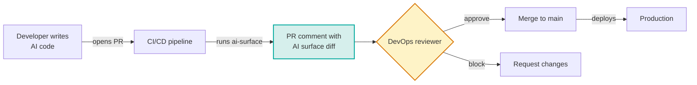
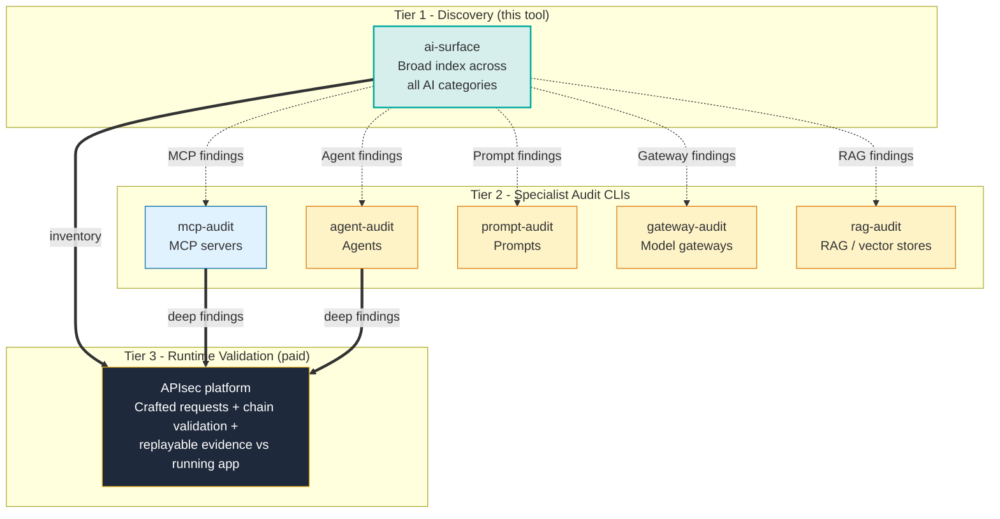
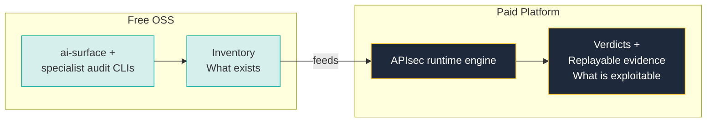

<div align="center">

# `ai-surface`

**Find and govern the AI surfaces in your code, at PR time, before they ship to production.**

[](https://opensource.org/licenses/MIT)
[](https://www.python.org/downloads/)
[](CHANGELOG.md)
[](#status)
[](tests/)
[](docs/PRIVACY.md)

</div>

> 🔒 **`ai-surface` is a static source-code analyzer that runs entirely on your machine.** A CLI scan makes no network calls and the project contains no telemetry code path of any kind, so your source never leaves the host you run it on. The full data-handling contract is in [`docs/PRIVACY.md`](docs/PRIVACY.md).

Your application code is shipping AI surfaces (LLM calls, agents, MCP servers, model gateways, self-hosted runtimes) faster than DevOps can govern them. `ai-surface` runs in your CI on every PR. It **surfaces every AI component your code is about to expose to production**, flags the permissions they hold and the risks they introduce, and can **fail the build** when a PR adds a risky one. Visibility plus a kill switch, at the cheapest control point you have.

<br>

## Table of Contents

- [The 60-second demo](#the-60-second-demo)
- [Why ai-surface exists](#why-ai-surface-exists)
- [How it fits in your workflow](#how-it-fits-in-your-workflow)
- [Quick start](#quick-start)
- [GitHub Action](#github-action)
- [What it detects](#what-it-detects)
- [Risk indicators](#risk-indicators)
- [How it works](#how-it-works-internals)
- [Output formats](#output-formats)
- [CLI reference](#cli-reference)
- [What it does not do (yet)](#what-it-does-not-do-yet)
- [Comparison with adjacent tools](#comparison-with-adjacent-tools)
- [Roadmap](#roadmap)
- [Status](#status)
- [Cross-sell: runtime validation](#runtime-validation)
- [Development](#development)
- [License](#license)

<br>

## The 60-second demo

```console
$ ai-surface scan examples/demo-app

AI Surface Report
────────────────────────────────────────────────────────────────
Scanned: demo-app
12 production AI surfaces · 13 risk indicators · across 6 detector(s)

LLM SDK CALL SITES
  • Anthropic SDK
      Models: claude-3-5-sonnet-20241022
      → src/llm_service.py
      ⚠ non-literal data flows into LLM call

AGENT FRAMEWORKS
  • LangChain Agent: support_agent (in src/chat_agent.py)
      Tools/perms: lookup_order, refund_payment, cancel_subscription
      ⚠ financial action exposed
      ⚠ high blast-radius combination
  • AWS Strands Agent: triage_agent (in src/support_workflow.py)
      Tools/perms: fetch_customer_profile, search_knowledge_base, escalate_to_human

MCP SERVERS
  • MCP Server: github-mcp        → ⚠ broad permissions
  • MCP Server: stripe-mcp        → ⚠ financial action exposed
  • MCP Server (in-house): src/orders_mcp_server.py
      ⚠ in-house MCP server (custom code, audit recommended)
      ⚠ financial action exposed

AI INFRASTRUCTURE
  • K8s AI Workload: vllm (in deploy/vllm-embeddings.yaml)
      ⚠ self-hosted LLM runtime (operational responsibility on the team)
  • Bedrock provisioned throughput: anthropic.claude-sonnet-4-...
      → deploy/bedrock.tf
      ⚠ high-cost AI infrastructure (billing exposure)

  ... (Model Gateways and AI Provider API Keys sections truncated)
────────────────────────────────────────────────────────────────
For source-level analysis of mcp servers: mcp-audit
Validate which surfaces are exploitable: apisec.ai/ai-validation
```

> Full captured output for every format is in [`examples/sample-outputs/`](examples/sample-outputs/). Add `--fail-on-risk` to exit non-zero (and fail the build) whenever any risk indicator is present.

<br>

## Why ai-surface exists



Most AI security and observability tools see AI activity **after it ships**: Helicone, LangSmith, Arize show what got called in production. Wiz and cloud platforms see what got deployed. They're useful and complementary.

`ai-surface` runs at the moment a developer is about to merge a change. It catches new MCP servers, widened permissions, agents with refund authority, and non-literal data flowing into LLM calls **before they exist in production**.

**PR-time visibility is materially different from post-deploy telemetry.** It's where DevOps governance has the cheapest control point.

<br>

## How it fits in your workflow

`ai-surface` is the **breadth scanner** in a family of OSS tools. Specialists go deep on individual AI stack categories:



**Today:** `ai-surface` and `mcp-audit` are shipping. The other specialists are on the roadmap.

<br>

## Quick start

`ai-surface` installs straight from this GitHub repository. PyPI publication is deferred until v1.0; until then the install commands point at the source repo and a tagged release.

```bash
# Install globally with pipx (recommended for a long-lived CLI)
pipx install git+https://github.com/apisec-inc/AI-Surface@v0.5.3
ai-surface scan .

# Or one-off, no install
pipx run --spec git+https://github.com/apisec-inc/AI-Surface@v0.5.3 ai-surface scan .

# Or inside a project venv
pip install git+https://github.com/apisec-inc/AI-Surface@v0.5.3
ai-surface scan .
```

For the GitHub Action, no install is needed (see the [GitHub Action](#github-action) section below for the workflow snippet).

Requires **Python 3.9 or newer**. The CLI scan runs 100% locally with no network calls. See [`docs/PRIVACY.md`](docs/PRIVACY.md) for the full data-handling contract.

> **Want to see it in action?** Clone the repo and run `ai-surface scan examples/demo-app/` against the included [demo app](examples/demo-app/). It exercises every detector category and produces a rich sample report. Captured outputs in [`examples/sample-outputs/`](examples/sample-outputs/).

### Recommended first-run flow on a mature repo

The first scan of an established codebase will surface every AI component already shipping, which is by design but can feel like noise. The pattern that scales:

```bash
# 1. Inventory what's there today and snapshot it as the baseline.
ai-surface scan . --update-baseline
# → reviews the full picture once, captures it to .ai-surface-baseline.json

# 2. From here on, only report what changes.
ai-surface scan . --baseline
# → shows ONLY new / modified / removed surfaces since the snapshot

# 3. In CI, gate only on NEWLY introduced risks (not pre-existing ones).
ai-surface scan . --baseline --fail-on-risk
```

The `.ai-surface-baseline.json` file is plain JSON. Commit it to track your team's accepted inventory in git, or add it to `.gitignore` if you prefer to regenerate locally.

<br>

## GitHub Action

Drop this into `.github/workflows/ai-surface.yml`:

```yaml
name: AI Surface Check
on: [pull_request]

permissions:
  contents: read
  pull-requests: write

jobs:
  ai-surface:
    runs-on: ubuntu-latest
    steps:
      - uses: actions/checkout@v4
        with: { fetch-depth: 0 }    # required for base-vs-head diff
      - uses: apisec-inc/AI-Surface@v0
        with:
          path: '.'
          comment-on-pr: 'true'
          fail-on-risk: 'false'
```

Every PR gets a **sticky comment** showing what changed in this PR, not just current state.

### Example PR comment

> ### AI Surface Changes
>
> **1 new, 1 modified**
>
> #### New AI surfaces
>
> - **MCP Server: stripe-mcp**
>   - Tools/permissions: `read_charges`, `refund`
>   - Files: `.mcp.json`
>   - ⚠️ broad permissions
>   - ⚠️ financial action exposed
>
> #### Modified AI surfaces
>
> - **LangChain Agent: refund_agent (in src/agents/refund.py)**
>   - Permissions added: `cancel_subscription`
>   - ⚠️ Risk added: high blast-radius combination

When the base branch isn't reachable (push event, first PR ever, fork PR without base history), the comment falls back to a full inventory of the current state.

Set `fail-on-risk: 'true'` to block PRs that introduce any risk indicators.

> **See [`docs/CI_INTEGRATION.md`](docs/CI_INTEGRATION.md) for advanced configuration:** policy files, multi-repo rollups, custom risk thresholds.

<br>

## What it detects

Six categories, one per detector:

| Category | Coverage | Examples |
|---|---|---|
| **LLM SDK call sites** | 12 providers | Anthropic, OpenAI, Azure OpenAI, AWS Bedrock (direct + Strands wrapper), Google Generative AI, Vertex AI, Together, Mistral, Cohere, Replicate, Groq, LiteLLM. Models extracted, data-flow risk flagged. |
| **Agent frameworks** | 10 frameworks | LangChain, LangGraph, CrewAI, LlamaIndex, AutoGen, Haystack, Semantic Kernel, Pydantic AI, AWS Strands, plus Anthropic-shape `tools=[{...}]`. Tool inventories per agent. |
| **MCP servers** | Config + in-house | Configured (`.mcp.json`, `mcp_servers/`) and source-resident in-house servers (Python `FastMCP`, `mcp.Server`, JS `@modelcontextprotocol/sdk`). Tool catalogs and capabilities. |
| **Model gateways** | Configs + source | LiteLLM proxy configs, Portkey, Helicone, Cloudflare AI Gateway, OpenRouter. Routed-model inventories. |
| **AI infrastructure** | Manifests + IaC | Kubernetes / Helm / docker-compose workloads running ollama, vllm, TGI, SGLang, Triton, llama.cpp and others; AI-runtime Dockerfiles; Terraform Bedrock provisioned throughput / custom models, SageMaker LLM endpoints, Vertex AI endpoints. |
| **AI provider env keys** | Names only | `OPENAI_API_KEY`, `ANTHROPIC_API_KEY`, `AZURE_OPENAI_*`, `GROQ_API_KEY`, `LANGSMITH_API_KEY`, etc. across `.env` files. **Never reads values.** |

> **See [`docs/DETECTORS.md`](docs/DETECTORS.md) for the complete coverage list, including every pattern matched and every framework version supported.**

<br>

## Risk indicators

`ai-surface` v0.5 understands **13 risk indicators** that get attached to findings:

| Indicator | Triggered by |
|---|---|
| `broad permissions` | MCP server with admin/write/delete capabilities |
| `in-house MCP server` | Custom MCP server code (audit recommended) |
| `financial action exposed` | Tool names containing refund/payment/charge/transfer |
| `destructive action exposed` | Tool names containing delete/drop/truncate/purge |
| `messaging action exposed` | send_email, send_slack, send_sms tool names |
| `database write exposed` | Database mutation tool patterns |
| `high blast-radius combination` | Agent with both read AND destructive/financial tools |
| `non-literal data flows into LLM call` | Variable references in `messages=` or `prompt=` |
| `multiple AI provider keys present` | More than one provider configured |
| `observability/tracing key present` | Production telemetry to third-party vendors |
| `multi-model routing layer` | Production traffic flowing through gateway |
| `self-hosted LLM runtime` | Operational responsibility on the team |
| `high-cost AI infrastructure` | Billing exposure (e.g., Bedrock provisioned throughput) |

<br>

## How it works (internals)

`ai-surface` is a **static source-code analyzer**. It reads files, pattern-matches, and produces a report. No code execution, no network calls, no credentials needed.


**What stays local:**

- Reads files from the directory you point it at, honouring the **root `.gitignore`** (nested gitignores, `.git/info/exclude`, and your global excludesfile are not consulted)
- Pattern-matches against known AI surface signatures
- Writes findings to stdout, a JSON file, a markdown file, or a PR comment

**What it does NOT do:**

- Run any of your code
- Connect to APIsec, third parties, or any external service during a normal scan
- Need credentials, tokens, or authentication to function
- Read `.env` file *values* (key names only)
- Persist anything beyond the report file you ask for

The only network call is the GitHub Action posting a PR comment via the GitHub API, using a token your workflow provides. **Local CLI runs are 100% offline.**

> **See [`docs/ARCHITECTURE.md`](docs/ARCHITECTURE.md) for the deep dive on detector design, the `Finding` schema, and how to add a custom detector.**

<br>

## Output formats

```bash
ai-surface scan .                          # rich terminal output
ai-surface scan . --output json            # machine-readable JSON
ai-surface scan . --output markdown        # markdown report
ai-surface scan . --write-inventory        # writes .ai-inventory.md to scan root
ai-surface scan . --quiet                  # one-line summary for CI
```

The `.ai-inventory.md` file is a **committable artifact**. Engineers browsing the repo see the AI surfaces in the same place they read everything else. The GitHub Action uses it as the diff baseline for PR comments.

<br>

## CLI reference

```bash
# Scan and report
ai-surface scan .                                # pretty terminal
ai-surface scan . --output json                  # machine-readable
ai-surface scan . --output markdown              # markdown
ai-surface scan . --write-inventory              # generates .ai-inventory.md

# Filter to specific categories
ai-surface scan . --categories mcp               # MCP servers only
ai-surface scan . --categories agents,llm        # agents + LLM SDKs
ai-surface scan . --categories infra             # AI infrastructure only
# Aliases: mcp, agents, llm, gateway, infra, keys

# CI gate: exit non-zero (code 1) if any risk indicator is present
ai-surface scan . --fail-on-risk                 # works in any CI, not just the GitHub Action
ai-surface scan . --fail-on-risk --quiet         # gate + one-line summary

# Baseline mode: snapshot the current inventory, then later show only what is NEW
ai-surface scan . --update-baseline              # writes .ai-surface-baseline.json
ai-surface scan . --baseline                     # diff vs the snapshot
ai-surface scan . --baseline --fail-on-risk      # CI gate fires only on NEWLY added risks
ai-surface scan . --baseline --baseline-file ci/baseline.json   # custom path

# CI / scripted use
ai-surface scan . --quiet                        # → ai-surface: 12 surfaces, 13 risks, 6 detectors

# Verbose mode
ai-surface scan . --verbose                      # all files (no truncation), surface detector errors

# Compare two scans (used by the GitHub Action under the hood)
ai-surface scan . --output json > base.json
git checkout pr-branch
ai-surface scan . --output json > head.json
ai-surface compare base.json head.json           # markdown diff
ai-surface compare base.json head.json --output json
```

<br>

## What it does not do (yet)

- **Runtime telemetry or behavior monitoring.** Use Helicone, LangSmith, Arize, or Phoenix for that.
- **Live cluster scanning.** Planned for v0.7.
- **Multi-repo or org-wide rollup.** Planned for v0.8.
- **Prompt injection or LLM behavior testing.** Different problem; out of scope by design. See the APIsec platform for runtime exploit validation.
- **Cross-file dataflow for tool resolution.** Regex-based today; AST in v0.6. This means the scanner can miss surfaces that only become clear across files. Treat the inventory as a strong floor, not a proof of completeness.
- **PII / secret-value detection.** `ai-surface` flags non-literal data flow into LLM calls and the *names* of provider keys, but it does not classify PII or read secret values. Use a dedicated secret scanner (gitleaks, GitGuardian) for values.
- **Standardised AI-BOM export** (SPDX / CycloneDX). The JSON and `.ai-inventory.md` are ai-surface's own formats today; a standard AI-BOM format is planned.

<br>

## Comparison with adjacent tools

| Tool | What it tells you | When it sees AI |
|---|---|---|
| **SAST** (Semgrep, Snyk Code, CodeQL) | Code-pattern vulnerabilities | After commit; doesn't index AI surfaces specifically |
| **DAST** (Burp, ZAP) | Reachable web surfaces with vulnerabilities | After deploy; sees HTTP, not LLM internals |
| **SCA** (Snyk Open Source, Dependabot) | Vulnerable dependencies | After commit; sees packages, not how they're used |
| **Observability** (Helicone, LangSmith, Arize, Phoenix) | What LLM calls happened, latency, cost | After deploy; sees runtime traffic |
| **Cloud posture** (Wiz, Orca) | What's deployed in cloud | After deploy; sees infra, not code |
| **`ai-surface`** | **What AI surfaces are about to ship** | **At PR time, before merge** |
| **APIsec platform** | Which AI surfaces are actually exploitable | At PR time + runtime; produces replayable evidence |

`ai-surface` doesn't replace any of these. It plugs the **PR-time-AI-inventory** gap that none of them fills.

<br>

## Roadmap

| Version | Status | What's in it |
|---|---|---|
| **v0.5** | Current (alpha) | Code-side detection across 6 categories, terminal + JSON + markdown reporters, GitHub Action with PR diff comments, base-vs-head comparison, 13 risk indicators, `--fail-on-risk` CI gate, `--baseline` mode for "only new since snapshot" CLI runs. Stable on real APIsec internal repos. |
| **v0.6** | Planned | SARIF output, AI-BOM export (SPDX / CycloneDX), `.ai-surface.yml` policy file, AST-based tool resolution, GitLab CI component. |
| **v0.7** | Planned | kubectl plugin, live cluster discovery, GitHub repo settings ingestion. |
| **v0.8** | Planned | Continuous mode, drift alerts, multi-repo rollup, hosted dashboard option. |
| **v1.0** | Planned | Stable schema, plugin SDK for custom detectors, performance work for monorepos. |

<br>

## Status

**v0.5.3 alpha (May 2026).** Code-side detection across six categories. The CLI works end to end with a `--fail-on-risk` gate that works in any CI and a `--baseline` mode that lets day-two runs surface only what has changed since a stored snapshot. The GitHub Action ships and posts sticky PR diff comments. Stable on real internal repos plus AWS Strands based agents. The roadmap above lists what is still planned, and feedback is what we want most at this stage.

If you find a false positive, false negative, or bug, please [file an issue](https://github.com/apisec-inc/AI-Surface/issues) using the templates.

<br>

## Runtime validation

<a id="runtime-validation"></a>

`ai-surface` tells you **what AI surfaces exist**. To validate which ones are actually exploitable in a running application (agent-to-tool authorization, integration chain exploits, BOLA across the agent layer, replayable evidence backed by code AND runtime), see [**APIsec**](https://apisec.ai/ai-validation).



<br>

## Development

```bash
git clone https://github.com/apisec-inc/AI-Surface
cd AI-Surface
python -m venv .venv && source .venv/bin/activate
pip install -e ".[dev]"
pytest
```

The codebase is structured for parallel detector development:

```
src/ai_surface/
├── cli.py                  # Typer entry point
├── orchestrator.py         # Runs detectors, aggregates findings
├── types.py                # Finding, Detector protocol, Report
├── detectors/              # One module per detector (one per category)
│   ├── mcp_servers.py
│   ├── llm_sdks.py
│   ├── agent_frameworks.py
│   ├── env_keys.py
│   ├── model_gateways.py
│   └── ai_infra.py
├── reporters/              # Output renderers
│   ├── terminal_reporter.py
│   ├── json_reporter.py
│   └── markdown_reporter.py
└── utils/
    ├── walk.py             # file walker (root .gitignore only)
    └── specs.py            # shared YAML / HCL parsing helpers
```

Adding a detector: implement the `Detector` protocol in `types.py`, register in `default_detectors()`, add fixtures + tests under `tests/`. See [CONTRIBUTING.md](CONTRIBUTING.md) for full details.

<br>

## Project

| Resource | Link |
|---|---|
| **Examples** | [examples/](examples/) (demo app, sample outputs, CI workflow templates) |
| **Issues** | [github.com/apisec-inc/AI-Surface/issues](https://github.com/apisec-inc/AI-Surface/issues) |
| **Discussions** | [github.com/apisec-inc/AI-Surface/discussions](https://github.com/apisec-inc/AI-Surface/discussions) |
| **Changelog** | [CHANGELOG.md](CHANGELOG.md) |
| **Security policy** | [SECURITY.md](SECURITY.md) |
| **Contributing** | [CONTRIBUTING.md](CONTRIBUTING.md) |
| **APIsec platform** | [apisec.ai](https://apisec.ai/ai-validation) |

<br>

## License

MIT. See [LICENSE](LICENSE).

---

<div align="center">

**Built by [APIsec](https://apisec.ai) · Part of the APIsec Labs OSS family**

</div>
