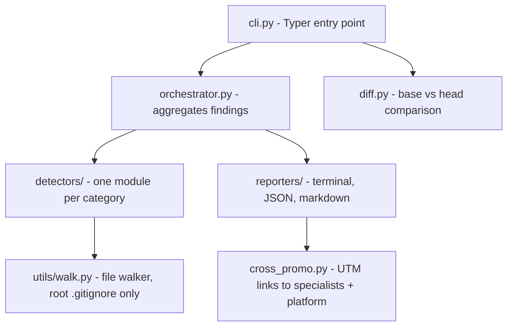
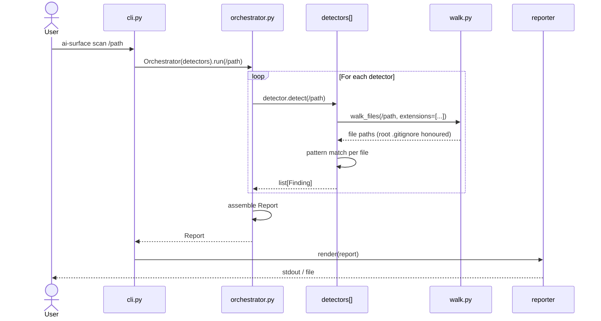
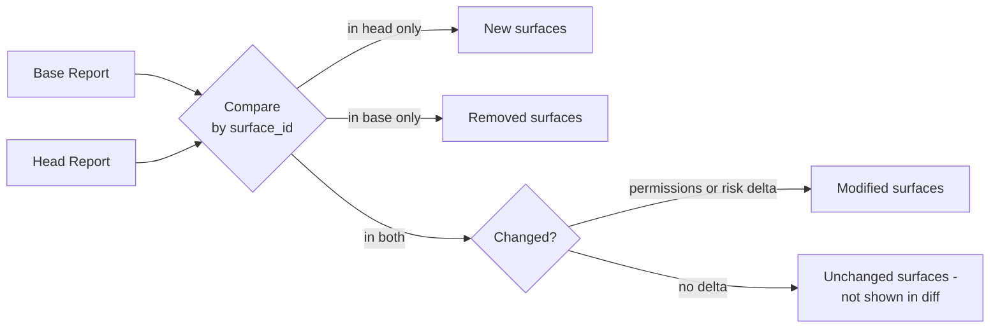
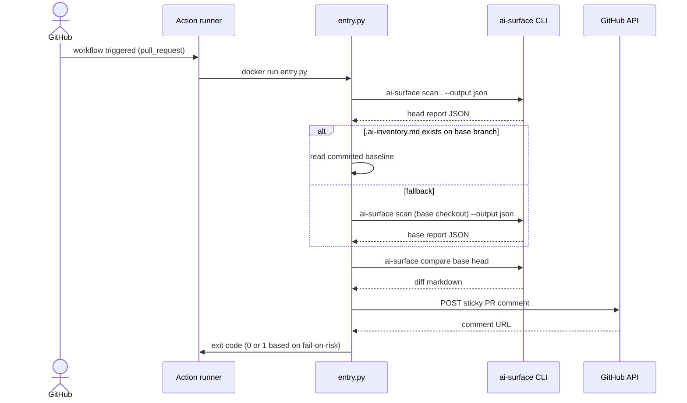

# Architecture

How `ai-surface` is structured internally, the contracts between components, and how to extend it.

This document is for contributors and operators who want to understand the tool beyond the user-facing README. If you just want to scan a repo, the [README](../README.md) is what you want.

## Contents

- [Design principles](#design-principles)
- [Component overview](#component-overview)
- [The data model](#the-data-model)
- [Detector protocol](#detector-protocol)
- [Scan lifecycle](#scan-lifecycle)
- [Reporter contracts](#reporter-contracts)
- [The diff engine](#the-diff-engine)
- [Cross-promotion module](#cross-promotion-module)
- [GitHub Action wrapper](#github-action-wrapper)
- [Adding a new detector](#adding-a-new-detector)
- [Performance characteristics](#performance-characteristics)

## Design principles

`ai-surface` was designed against these constraints:

1. **Static-only.** No code execution, no network calls, no credentials. The tool must work on a developer laptop with no setup beyond `pip install`.
2. **Stateless per run.** Each scan walks the file tree from scratch. No persistent cache, no daemon, no incremental analysis. Cross-file effects mean incremental analysis would have to recompute most of the same work for correctness.
3. **Conservative findings.** False positives kill adoption faster than false negatives. We'd rather miss a surface than flag a non-surface.
4. **Composable outputs.** The same scan output feeds local dev, CI, audit logs, and the cross-promo to the APIsec platform. One scan, many consumers.
5. **Detector isolation.** A buggy detector should not kill the whole scan. The orchestrator catches per-detector exceptions and emits them as report errors.

## Component overview



Each detector module is independent. They run sequentially today (v0.5), but parallel execution is on the roadmap for v1.0.

## The data model

Three core types in `src/ai_surface/types.py`:

```python
@dataclass
class Evidence:
    files: list[str]              # Where the finding was located
    snippet: str                  # A representative line of source
    line_numbers: list[int]       # Optional line refs
    metadata: dict[str, Any]      # Detector-specific extras (models_used, tool_count, etc.)


@dataclass
class Finding:
    surface: str                  # Display name (e.g. "LangChain Agent: refund_agent")
    category: str                 # One of: mcp-server, llm-sdk, agent-framework, env-key, model-gateway, ai-infra
    evidence: Evidence
    permissions: list[str]        # Tools or capabilities exposed
    risk_indicators: list[str]    # Conservative semantic flags
    detector_name: str            # Set by orchestrator


@dataclass
class Report:
    findings: list[Finding]
    scan_root: str
    scan_timestamp: str           # ISO 8601 with timezone
    detectors_run: list[str]
    errors: list[str]             # Per-detector failures, captured not raised
```

**The contract is stable across reporters.** Terminal, JSON, markdown, and diff all consume the same `Report`: New reporters just need to consume this shape.

## Detector protocol

A detector is anything that satisfies this Python `Protocol`:

```python
class Detector(Protocol):
    name: str                                      # Unique identifier
    category: str                                  # One of the category constants

    def detect(self, root_path: str) -> list[Finding]:
        ...
```

That's it. The orchestrator calls `detect(root_path)`, captures exceptions, and aggregates results. A detector decides for itself how to walk files, what to read, and what shape its findings take.

Most detectors share infrastructure via `utils/walk.py` (a file walker that prunes a fixed set of build/vendor directories and honours the **scan-root** `.gitignore` only — nested `.gitignore` files, `.git/info/exclude`, and the global git excludesfile are NOT consulted) and `utils/io.py` (safe text reading with encoding fallback), but neither is required by the protocol.

The walker enforces hard resource caps so a pathological or hostile tree cannot stall the scanner: `MAX_FILES = 250,000` files per traversal and `MAX_TOTAL_BYTES = 5 GiB` of cumulative content size, accounted via `os.lstat` so symlinks count as their own inode size. Per-file reads via `read_text_safe` are bounded at 5 MB and symlinks are refused outright. See `SECURITY.md` for the full threat-model rationale.

## Scan lifecycle



Per-detector errors are caught by the orchestrator. A detector that raises is reported in `report.errors` with the exception class name and message. Other detectors still run. The CLI shows the error count in default mode; `-v` shows the full error detail.

## Reporter contracts

Three reporters ship with v0.5:

| Reporter | Use case | Output |
|---|---|---|
| `terminal_reporter.py` | Local dev, interactive | Rich-styled stdout with colors, sections, click-through links |
| `json_reporter.py` | CI scripting, programmatic | Schema-versioned JSON envelope |
| `markdown_reporter.py` | Reports, `.ai-inventory.md`, PR comments | Markdown with headings and risk callouts |

Each reporter exposes a function with the same shape:

```python
def render_<format>(report: Report, ...) -> str | None:
    ...
```

Terminal renders directly to a `rich.Console`: JSON and markdown return strings the CLI prints. Adding a reporter (e.g., SARIF, CycloneDX): implement a `render_sarif(report) -> str`, register it in `cli.py`, add tests.

## The diff engine

`diff.py` computes the delta between two scans. Used by:

1. The `ai-surface compare base.json head.json` CLI command
2. The GitHub Action, which scans the PR head and diffs against `.ai-inventory.md` from the base branch

The diff algorithm:



Surfaces are matched by a stable `surface_id` derived from category + surface name + primary file path. This is the contract that the future specialist CLIs (`mcp-audit`, `agent-audit`, etc.) will share. same `surface_id` means same surface, enabling cross-tool joins.

## Cross-promotion module

`cross_promo.py` is the link between OSS findings and the paid platform (and between OSS tools themselves).

```python
SPECIALIST_TOOLS = {
    "mcp-server": {
        "tool": "mcp-audit",
        "url": "https://github.com/apisec-inc/mcp-audit",
        "tagline": "deep audit of MCP server configs and capabilities",
        "available": True,
    },
    "agent-framework": {
        "tool": "agent-audit",
        "url": "https://github.com/apisec-inc/agent-audit",
        "tagline": "deep audit of agent tool authority and blast radius",
        "available": False,  # Not yet shipped. hidden from output
    },
    ...
}
```

When a finding has risk indicators, the reporter calls `build_upgrade_url(finding, source="ai-surface", medium="cli")` to construct a UTM-tagged deep link to the APIsec platform validation page. Each deep link carries:

- `surface`: the category
- `risk`: the primary risk indicator
- `utm_source`: always `ai-surface`
- `utm_medium`. `cli` / `markdown` / `pr-comment` / etc.
- `utm_campaign`. `oss-funnel`

This is how we close the loop from OSS discovery to platform validation.

## GitHub Action wrapper

The Action is in `.github/action/entry.py` plus `action.yml` and `Dockerfile`: Flow:



The Action is a thin shell. All the logic is in the Python CLI; the Action just orchestrates the scan, comparison, and comment posting. This makes the local CLI and CI behavior strictly equivalent.

## Adding a new detector

1. **Create the module:** `src/ai_surface/detectors/your_category.py`: Define a class with `name`, `category`, and `detect(root_path) -> list[Finding]`.
2. **Register it:** Add to `default_detectors()` in `orchestrator.py`.
3. **Add a category constant** if you're introducing one: `types.py`.
4. **Add display strings:** if the terminal reporter needs custom formatting, register in `CATEGORY_DISPLAY` in `terminal_reporter.py`.
5. **Add cross-promo registration** if a specialist tool exists for this category: `cross_promo.py`.
6. **Write tests:** fixtures under `tests/fixtures/your_category/`, test cases under `tests/test_your_category.py`: Cover the positive case, false-positive resistance, edge cases.
7. **Update docs:** README detector table, this file's coverage list.

A reasonable detector PR adds 100-300 lines of code, 50-150 lines of test coverage, and a few fixture files. The longest part is usually verifying coverage against real-world code samples.

## Performance characteristics

`ai-surface` is built for sub-second scans on typical project repos.

| Repo size (relevant files) | Typical scan time |
|---|---|
| Under 50 files | Under 0.3s |
| 50-200 files | 0.3-1s |
| 200-500 files | 1-2s |
| 500-2,000 files | 2-5s |
| 2,000-10,000 files | 5-10s |
| Larger monorepos | TBD; v1.0 work |

Time is more sensitive to **how many surfaces exist** than to file count. Repos with zero AI surfaces scan very fast because we walk fast and decline to match fast. Repos with active AI surfaces take longer because we extract per-finding metadata (models, tool lists, file evidence).

## Where to learn more

- [README.md](../README.md). User-facing intro
- [docs/CI_INTEGRATION.md](CI_INTEGRATION.md). GitHub Action deep dive
- [docs/DETECTORS.md](DETECTORS.md). Full detector coverage matrix
- [CONTRIBUTING.md](../CONTRIBUTING.md). How to contribute
- [CHANGELOG.md](../CHANGELOG.md). Release history
