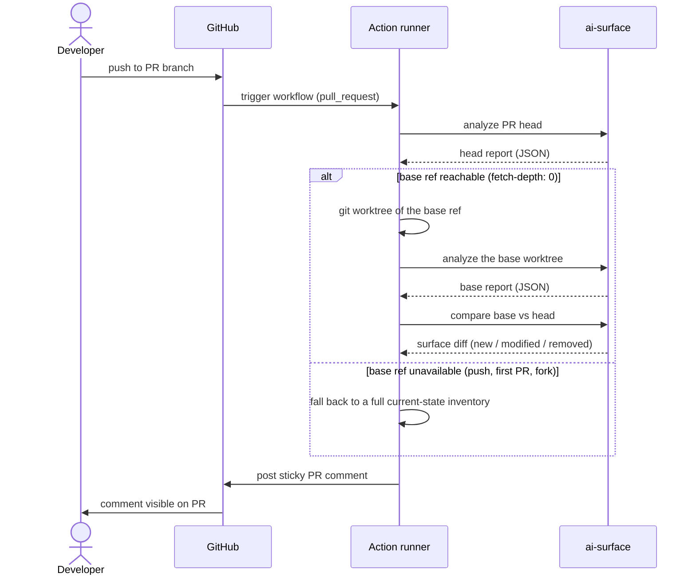

# CI Integration Guide

This guide shows how to run `ai-surface` in CI/CD to map AI surfaces introduced by pull requests, post a PR comment, generate machine-readable reports, and optionally block merges when new high-risk findings appear.

`ai-surface` runs locally inside your CI runner. It does not send source code, findings, or metadata to APIsec. When PR comments are enabled, the GitHub Action uses the repository's `GITHUB_TOKEN` to post or update a comment through the GitHub API.

## Contents

- [The basic GitHub Action](#the-basic-github-action)
- [What the PR comment looks like](#what-the-pr-comment-looks-like)
- [How PR diffs work](#how-pr-diffs-work)
- [Configuration reference](#configuration-reference)
- [Baseline options](#baseline-options)
- [Blocking merges on risk](#blocking-merges-on-risk)
- [Report artifacts](#report-artifacts)
- [GitHub code scanning with SARIF](#github-code-scanning-with-sarif)
- [Multi-job workflows](#multi-job-workflows)
- [GitLab CI](#gitlab-ci)
- [Generic CI](#generic-ci)
- [Fork PRs and permissions](#fork-prs-and-permissions)
- [Exit codes](#exit-codes)
- [Troubleshooting](#troubleshooting)

## The basic GitHub Action

Drop this into `.github/workflows/ai-surface.yml`:

```yaml
name: AI Surface Check
on: [pull_request]

permissions:
  contents: read
  pull-requests: write   # required when comment-on-pr is true

jobs:
  ai-surface:
    runs-on: ubuntu-latest
    steps:
      - uses: actions/checkout@v4
        with:
          fetch-depth: 0  # required for base-vs-head diff

      - uses: apisec-inc/AI-Surface@v1
        with:
          path: '.'
          comment-on-pr: 'true'
          fail-on: 'high'  # fail only on NEW high-or-critical findings
```

This maps the AI surfaces introduced by each pull request and posts a sticky PR comment showing what changed.

Three things to know:

1. `fetch-depth: 0` is required so the action can compare the PR branch against the base branch.
2. `pull-requests: write` is required when `comment-on-pr` is enabled.
3. No API keys are required. The action uses the built-in `GITHUB_TOKEN` provided by GitHub Actions.

The local analysis runs inside the GitHub runner. No source code, findings, or metadata are sent to APIsec. The only outbound call the action makes is to GitHub's API when it posts or updates the PR comment.

## What the PR comment looks like

When `comment-on-pr` is enabled, the action posts or updates a sticky comment with the AI surface diff for the pull request. Example:

```md
## AI Surface Changes

1 new surface · 1 high-risk finding

### New surfaces

- **LangChain Agent:** `support_agent`
  - Tools: `lookup_order`, `process_refund`, `send_email`
  - Risk: `high-blast-radius`
  - Evidence: read + financial/destructive tool authority

### API exposure

- `PATCH /customers/{customer_id}`
  - Review: object-id path segment may need BOLA authorization review

### Gate result

Failed: this PR introduces a new `HIGH` finding.

Suggested review:
- Confirm refund execution requires human approval
- Confirm `customer_id` authorization is enforced server-side
- Confirm tool invocation is logged
```

The exact comment depends on the surfaces and findings introduced by the PR. Inventory-only changes are shown for review but do not fail the build unless a configured gate is tripped.

## How PR diffs work

On pull requests, the action compares the PR branch against the base branch and reports what changed.



At a high level:

1. Analyze the PR head.
2. Create a git worktree of the base ref and analyze it.
3. Compare base vs head.
4. Post the AI surface diff.
5. Apply the configured gate only to findings in scope for the PR (newly introduced ones).

This is why `actions/checkout` must use `fetch-depth: 0`: the action needs enough git history to reach the base branch. On non-PR events such as `push`, there may be no base to compare against; gates then apply to the current project state. The comparison runs entirely on the runner.

## Configuration reference

Inputs the GitHub Action supports:

| Input | Default | Description |
|---|---|---|
| `path` | `.` | Directory to analyze, relative to the repository root. |
| `comment-on-pr` | `true` | Post or update a sticky PR comment when running on pull requests. |
| `fail-on` | unset | Fail when a finding at or above this severity is introduced (`critical`, `high`, `medium`, `low`). |
| `fail-on-risk` | `false` | Aggressive mode: fail on any risk indicator, even with no severity threshold set. |
| `write-inventory` | `false` | Write a human-readable `.ai-inventory.md` inventory artifact back to the workspace. |
| `github-token` | `${{ github.token }}` | Token used for PR comments. Defaults to the built-in GitHub token. |

Outputs available from the Action:

| Output | Description |
|---|---|
| `surfaces-count` | Number of production AI surfaces detected |
| `risk-count` | Number of risk indicators detected |
| `json-report` | Path to the JSON report file in the runner workspace |

Example using outputs:

```yaml
- uses: apisec-inc/AI-Surface@v1
  id: scan
  with:
    path: '.'
- name: Post summary
  run: |
    echo "Found ${{ steps.scan.outputs.surfaces-count }} AI surfaces"
    echo "Found ${{ steps.scan.outputs.risk-count }} risk indicators"
```

## Baseline options

There are two common ways to avoid blocking on AI surfaces that already exist in the repo.

### Option A: Base-vs-head comparison (the GitHub Action default)

On pull requests, the action compares the PR branch against the base branch during the CI run (see [How PR diffs work](#how-pr-diffs-work)). The gate applies only to newly introduced findings.

Pros:

- No committed baseline artifact to maintain.
- No merge conflicts from generated files.
- Always compares against the current base branch.

Cons:

- Requires analyzing both base and head.

### Option B: Committed machine baseline (CLI / other CI)

For mature repos, or in CI systems without automatic base-vs-head, commit a machine-readable baseline and gate only against changes from it:

```bash
ai-surface scan . --update-baseline
git add .ai-surface-baseline.json
git commit -m "chore: baseline AI surface inventory"
```

Then gate future changes:

```bash
ai-surface scan . --baseline --fail-on high
```

Pros:

- Low-noise adoption; does not block on historical AI surfaces.
- Makes baseline updates explicit.

Cons:

- Teams must update the baseline intentionally, and it can drift if they do not.

`.ai-surface-baseline.json` is the machine-readable baseline. `.ai-inventory.md` (written by `--write-inventory`) is a human-readable inventory artifact for review and documentation; it is not the machine baseline.

## Blocking merges on risk

The recommended PR gate:

```yaml
- uses: apisec-inc/AI-Surface@v1
  with:
    path: '.'
    comment-on-pr: 'true'
    fail-on: 'high'
```

This fails the job only when a new high-or-critical finding is introduced. Inventory-only findings do not fail the build. `fail-on` gates on assessed severity, which is set only by the deep-dive audit (MCP, agent, RAG); discovery-only inventory never trips it.

Combined with branch protection ("Require status checks to pass before merging"), this blocks the merge button on a new high-risk finding.

For stricter teams:

```yaml
fail-on: 'medium'
```

For the strictest severity gate:

```yaml
fail-on: 'critical'
```

For aggressive mode:

```yaml
fail-on-risk: 'true'   # noisy: fail on ANY risk indicator, severity or not
```

`fail-on-risk` is intentionally noisy. Use it only when you want any risk indicator to block the build.

## Report artifacts

Generate reports as part of CI:

```bash
ai-surface scan . --output json      > ai-surface.json
ai-surface scan . --output markdown  > ai-surface.md
ai-surface scan . --output cyclonedx > ai-bom.json
```

- JSON is for automation and post-processing.
- Markdown is for human review.
- CycloneDX is the AI-BOM artifact (the same inventory + governance mappings your pipeline would attach to a release alongside an SBOM).

## GitHub code scanning with SARIF

To surface findings in the GitHub Security tab:

```yaml
- name: Generate SARIF
  run: uvx --from apisec-ai-surface ai-surface scan . --output sarif > ai-surface.sarif

- name: Upload SARIF
  uses: github/codeql-action/upload-sarif@v3
  with:
    sarif_file: ai-surface.sarif
```

SARIF gives Security-tab visibility and inline PR annotations. PR gating is still configured through `fail-on` (or `fail-on-risk`).

## Multi-job workflows

Split analysis and policy enforcement into separate jobs for visibility:

```yaml
jobs:
  scan:
    runs-on: ubuntu-latest
    outputs:
      json-report: ${{ steps.scan.outputs.json-report }}
    steps:
      - uses: actions/checkout@v4
        with:
          fetch-depth: 0
      - uses: apisec-inc/AI-Surface@v1
        id: scan

  enforce-policy:
    needs: scan
    runs-on: ubuntu-latest
    steps:
      - name: Custom policy gate
        run: |
          # Post-process ${{ needs.scan.outputs.json-report }} with jq, e.g. gate on
          # specific flags or categories beyond what fail-on covers.
```

## GitLab CI

Install from PyPI and use the exit code as the gate:

```yaml
ai_surface:
  image: python:3.11
  stage: test
  before_script:
    - pip install apisec-ai-surface
  script:
    - ai-surface scan . --output json > ai-surface.json
    - ai-surface scan . --fail-on high
  artifacts:
    when: always
    paths:
      - ai-surface.json
  only:
    - merge_requests
```

For merge-request diffs (base-vs-head without a committed baseline), analyze both refs and compare:

```yaml
  script:
    - ai-surface scan . --output json > head.json
    - git fetch origin "$CI_MERGE_REQUEST_TARGET_BRANCH_NAME"
    - git checkout "origin/$CI_MERGE_REQUEST_TARGET_BRANCH_NAME"
    - ai-surface scan . --output json > base.json
    - git checkout "$CI_COMMIT_SHA"
    - ai-surface compare base.json head.json > diff.md
```

Prefer `uvx --from apisec-ai-surface ai-surface ...` (with the `ghcr.io/astral-sh/uv` image) if you want a one-off run with no persistent install.

## Generic CI

In any CI system, install the CLI and use the exit code as the gate:

```bash
pip install apisec-ai-surface
ai-surface scan . --fail-on high
```

For a one-off run without a persistent install:

```bash
uvx --from apisec-ai-surface ai-surface scan . --fail-on high
```

For a base-vs-head surface diff, analyze both refs and `ai-surface compare base.json head.json` (as in the GitLab example above), then post the diff through your CI's preferred mechanism.

## Fork PRs and permissions

For public repositories, GitHub restricts write permissions for workflows triggered by pull requests from forks. In those cases:

- analysis and gating still run
- PR comments may be skipped if the token does not have write permission
- maintainers can inspect the CI log or uploaded artifacts

Do not switch untrusted analysis to `pull_request_target` just to get write permissions. `pull_request_target` runs with privileges from the base repository and can expose write tokens or secrets if it checks out and runs untrusted fork code. (`ai-surface`'s Action refuses to run under `pull_request_target` for this reason.)

If you need privileged comment posting for fork PRs, use a two-stage design:

1. an unprivileged `pull_request` workflow analyzes the fork code and uploads sanitized artifacts
2. a privileged `workflow_run` workflow reads those artifacts and posts the comment

## Exit codes

| Code | Meaning |
|---:|---|
| `0` | Completed successfully; no configured gate was tripped |
| `1` | A configured gate was tripped, such as `--fail-on high` or `--fail-on-risk` |
| `2` | Invalid arguments, invalid path, or a configuration/usage error |

`--fail-on <severity>` and `--fail-on-risk` both exit `1` when they block. In `--baseline` mode, exit `1` means the gate was tripped by findings in scope for that comparison (newly introduced ones). Detector errors do not fail the run by default; they are captured in the report's `errors` and surfaced in the output (use `--verbose` for detail).

## Troubleshooting

### The PR comment did not appear

Check:

- `comment-on-pr: 'true'`
- `permissions.pull-requests: write`
- the workflow is running on a `pull_request` event
- the PR is not from a fork with restricted token permissions (see [Fork PRs and permissions](#fork-prs-and-permissions))

### The action cannot compute a diff

Check:

- `actions/checkout` uses `fetch-depth: 0`
- the workflow has access to the base branch
- the repository is not using an unusual checkout/ref configuration

A brand-new repo or first PR legitimately has no base to compare against; a full current-state inventory is the expected fallback.

### The job failed on existing findings

For mature repos, baseline first so only new findings gate:

```bash
ai-surface scan . --update-baseline
ai-surface scan . --baseline --fail-on high
```

Or rely on the GitHub Action's base-vs-head comparison, which only gates newly introduced findings.

### I only want reporting, not blocking

Do not set `fail-on` or `fail-on-risk`. The action still posts the PR comment.

### I want stricter blocking

Use `fail-on: medium` (or `fail-on: critical` for the strictest severity gate), or `fail-on-risk: 'true'` for the aggressive any-indicator mode.

### Duplicate comments accumulating

The action posts a single sticky comment that updates in place. Multiple comments usually mean the previous comment was deleted by hand, the token cannot update prior comments, or the hidden marker was edited. File an issue with the run log if you can reproduce.

---

For internals, see [docs/ARCHITECTURE.md](ARCHITECTURE.md). For the full detector list, see [docs/DETECTORS.md](DETECTORS.md). Questions or bugs: [open an issue](https://github.com/apisec-inc/AI-Surface/issues).
