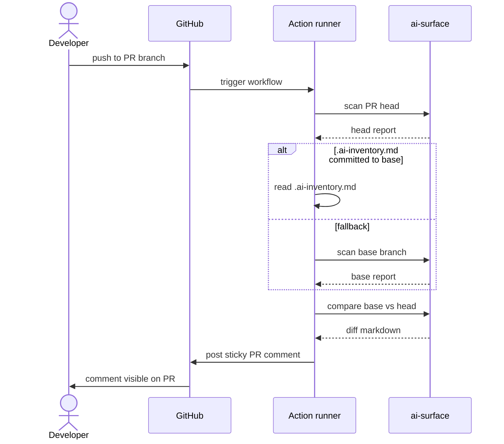

# CI Integration Guide

Detailed guide for running `ai-surface` in continuous integration. Covers the GitHub Action, configuration options, advanced patterns, and operational concerns.

## Contents

- [The basic GitHub Action](#the-basic-github-action)
- [How the diff works](#how-the-diff-works)
- [Configuration reference](#configuration-reference)
- [Committed inventory vs runtime baseline](#committed-inventory-vs-runtime-baseline)
- [Blocking merges on risk](#blocking-merges-on-risk)
- [Multi-job workflows](#multi-job-workflows)
- [GitLab CI](#gitlab-ci)
- [Generic CI](#generic-ci)
- [Troubleshooting](#troubleshooting)

## The basic GitHub Action

The minimum viable workflow:

```yaml
name: AI Surface Check
on: [pull_request]

permissions:
  contents: read
  pull-requests: write

jobs:
  ai-surface:
    runs-on: ubuntu-latest
    steps:
      - uses: actions/checkout@v4
        with: { fetch-depth: 0 }
      - uses: apisec-inc/AI-Surface@v0
```

This runs the scanner on every pull request and posts a sticky comment showing what AI surfaces the PR adds, modifies, or removes.

**Three things to know:**

1. **`fetch-depth: 0`** is required so the Action can compare against the base branch.
2. **`pull-requests: write`** is required so the Action can post (and update) PR comments.
3. **The Action is a Docker container**, so the first run on a fresh runner takes 10-15s longer to pull the image. Subsequent runs are cached.

## How the diff works



The diff is computed on the runner. Nothing is sent to APIsec or any third party. The only outbound network call is the GitHub API to post the comment.

## Configuration reference

All inputs to the GitHub Action:

| Input | Default | Purpose |
|---|---|---|
| `path` | `.` | Directory to scan, relative to repository root |
| `comment-on-pr` | `true` | Post (or update) a PR comment with the report. Set `false` to disable. |
| `fail-on-risk` | `false` | Exit non-zero if any risk indicators are detected. Use this to block merges. |
| `write-inventory` | `false` | Write `.ai-inventory.md` back to the workspace (useful for the bootstrap commit) |
| `github-token` | `${{ github.token }}` | Token used to post comments. Override only for special permission scenarios. |

Outputs available from the Action:

| Output | Description |
|---|---|
| `surfaces-count` | Number of production AI surfaces detected |
| `risk-count` | Number of risk indicators detected |
| `json-report` | Path to the JSON report file in the runner workspace |

Example using outputs:

```yaml
jobs:
  ai-surface:
    runs-on: ubuntu-latest
    steps:
      - uses: actions/checkout@v4
        with: { fetch-depth: 0 }
      - uses: apisec-inc/AI-Surface@v0
        id: scan
      - name: Post summary
        run: |
          echo "Found ${{ steps.scan.outputs.surfaces-count }} AI surfaces"
          echo "Found ${{ steps.scan.outputs.risk-count }} risks"
```

## Committed inventory vs runtime baseline

There are two ways to maintain the diff baseline:

### Path A: Committed `.ai-inventory.md` (recommended for visibility)

On main, generate and commit the inventory:

```bash
ai-surface scan . --write-inventory
git add .ai-inventory.md
git commit -m "chore: bootstrap AI surface inventory"
```

The Action reads this file on every PR and diffs against it.

**Pros:**
- The repo always shows the current AI surface inventory as a committed artifact
- Reviewers browsing the repo see what AI lives there in the same place they read everything else
- Single scan per PR (faster CI)
- The inventory file is the source of truth for compliance / audit conversations

**Cons:**
- Requires discipline: keep `.ai-inventory.md` updated as you merge AI changes
- Merge conflicts on the inventory file if multiple PRs touch AI surfaces concurrently (resolvable but mildly annoying)

### Path B: Runtime baseline (no commit needed)

No `.ai-inventory.md` in the repo. The Action checks out the base branch and scans it on every PR.

**Pros:**
- No artifact to maintain
- No merge conflict risk

**Cons:**
- Two scans per PR (slightly slower; usually 1-3 extra seconds)
- The inventory isn't visible to anyone browsing the repo without running the tool

### How the Action chooses

The Action automatically uses Path A if `.ai-inventory.md` is present on the base branch. Otherwise it falls back to Path B. No configuration required.

## Blocking merges on risk

To hard-block PRs that introduce risk indicators:

```yaml
- uses: apisec-inc/AI-Surface@v0
  with:
    fail-on-risk: 'true'
```

The Action exits non-zero. Combined with branch protection rules (Require status checks to pass before merging), this blocks the merge button.

To allow specific risk indicators without blocking, use a policy file (see v0.6 roadmap) or post-process the JSON report:

```yaml
- uses: apisec-inc/AI-Surface@v0
  id: scan
  with:
    fail-on-risk: 'false'      # Don't fail the step; we'll check below

- name: Block on high-severity risks only
  run: |
    HIGH_RISKS=$(jq '[.findings[].risk_indicators[] | select(. == "broad permissions" or . == "financial action exposed" or . == "high blast-radius combination")] | length' ${{ steps.scan.outputs.json-report }})
    if [ "$HIGH_RISKS" -gt 0 ]; then
      echo "::error::Blocking due to $HIGH_RISKS high-severity AI surface risks"
      exit 1
    fi
```

## Multi-job workflows

Split scan and policy enforcement into separate jobs for visibility:

```yaml
jobs:
  scan:
    runs-on: ubuntu-latest
    outputs:
      json-report: ${{ steps.scan.outputs.json-report }}
    steps:
      - uses: actions/checkout@v4
        with: { fetch-depth: 0 }
      - uses: apisec-inc/AI-Surface@v0
        id: scan

  enforce-policy:
    needs: scan
    runs-on: ubuntu-latest
    steps:
      - name: Policy gate
        run: |
          # Custom enforcement logic on ${{ needs.scan.outputs.json-report }}
```

## GitLab CI

A `.gitlab-ci.yml` equivalent of the GitHub Action:

```yaml
ai-surface:
  image: python:3.11-slim
  before_script:
    - pip install ai-surface
  script:
    - ai-surface scan . --output json > head.json
    - git checkout origin/$CI_DEFAULT_BRANCH
    - ai-surface scan . --output json > base.json
    - git checkout $CI_COMMIT_SHA
    - ai-surface compare base.json head.json > diff.md
  artifacts:
    paths:
      - diff.md
      - head.json
  only:
    - merge_requests
```

A native GitLab CI component is planned for v0.6.

## Generic CI

For any other CI system, the pattern is:

```bash
# On the PR head
ai-surface scan . --output json > head.json

# On the base branch
git checkout <base-ref>
ai-surface scan . --output json > base.json
git checkout <head-ref>

# Compare
ai-surface compare base.json head.json > diff.md
# or
ai-surface compare base.json head.json --output json > diff.json

# Post the diff via your CI's preferred mechanism (Slack, email, status check)
```

The CLI exit codes:

- `0`: Success, no failures
- `1`: Risk indicators present + `--fail-on-risk` flag set
- `2`: Detector errors occurred (use `-v` to inspect)
- `3`: CLI argument or path error

## Troubleshooting

### The PR comment isn't appearing

1. Confirm the workflow has `pull-requests: write` permission.
2. Confirm `comment-on-pr: 'true'` is set (default is `true`, but check).
3. Look at the Action's run log. does it report posting the comment?
4. For fork PRs, GitHub restricts the workflow token's permissions so the comment may fail silently. **Do not** switch the trigger to `pull_request_target` to work around this. ai-surface refuses to run under `pull_request_target` because that event exposes repo secrets to attacker-controlled PR code. If you must surface results on fork PRs, use a separate `workflow_run` workflow that downloads the artifact produced by the safe `pull_request` run and posts the comment from the privileged context.

### The diff shows the full inventory instead of changes

1. Confirm `fetch-depth: 0` is set on the checkout step.
2. Confirm either `.ai-inventory.md` is committed to the base branch, or that the base branch is reachable for a runtime scan.
3. First PRs in a brand-new repo legitimately have no baseline; the full inventory is the expected fallback.

### Scan takes too long

1. Run with `--verbose` locally to see which detectors take the most time.
2. Confirm `.gitignore` is excluding generated files (build artifacts, vendored dependencies, etc.).
3. For monorepos: scope the scan to a subdirectory using `path: 'services/my-service'`.
4. Performance work for very large monorepos is on the v1.0 roadmap.

### The Action posts comments on every push, polluting the PR

By default, the Action posts a **sticky** comment that updates in place on subsequent pushes. If you see multiple comments accumulating, the sticky-comment logic is failing. This is usually because:

1. The previous comment was deleted by hand (the Action treats this as "no comment exists" and creates a fresh one)
2. The token doesn't have permission to update prior comments
3. The hidden marker in the comment was edited

File an issue with the run log if you can reproduce.

### How do I run this on a private repo?

If `apisec-inc/AI-Surface` is public (the public alpha goal), nothing special is needed. The Action runs in your CI runner; it doesn't need access to your repo beyond the standard `actions/checkout`.

If you're running a fork or pinned version, replace `apisec-inc/AI-Surface@v0` with your fork's reference.

---

For deeper questions, see [docs/ARCHITECTURE.md](ARCHITECTURE.md) or [open an issue](https://github.com/apisec-inc/AI-Surface/issues).
